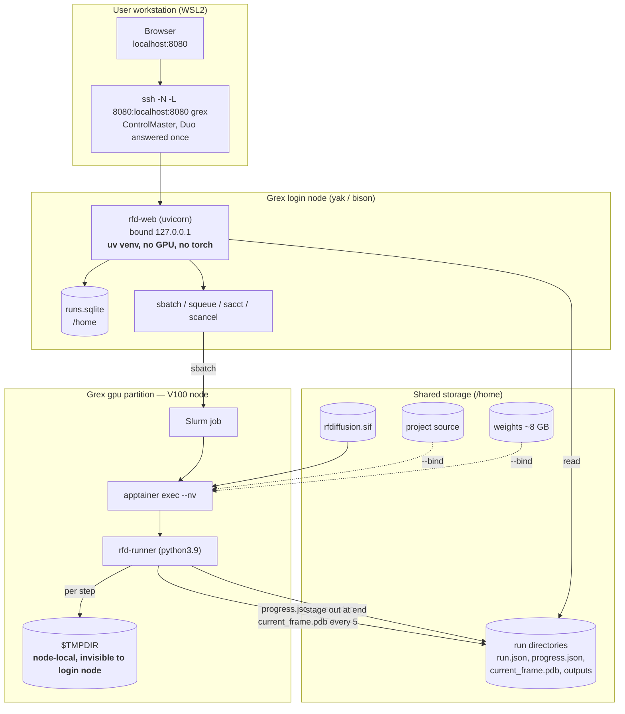

# U1 Runtime and Container — Deployment Architecture

---

## 1. Node Topology



**Text alternative**: The browser reaches the web app through an SSH tunnel to a Grex login node,
where `rfd-web` runs in a `uv` venv bound to localhost with no GPU and no PyTorch. It reads and writes
a SQLite index on `/home`, reads run directories, and shells out to Slurm. Slurm places the job on a
V100 node in the `gpu` partition, where `apptainer exec --nv` runs `rfd-runner` inside the image with
the project source and weights bind-mounted. The runner writes per-step dumps to node-local `$TMPDIR`
— invisible to the login node — and publishes `progress.json` every step and `current_frame.pdb`
every fifth step to shared storage, staging full outputs out at the end.

**The boundary that shapes everything**: the login node and compute node share `/home` but **not**
`$TMPDIR`. That single fact produced DD-6 and is why `current_frame.pdb` exists.

---

## 2. Bind-Mount Map

| Host path | Container path | Mode | Purpose |
|---|---|---|---|
| `$RFD_PROJECT_ROOT` | `/opt/rfdgui` | ro | `rfd-core` + `rfd-runner` source (DD-2) |
| `$RFD_WEIGHTS` | `/opt/weights` | ro | checkpoints, AlphaFold params, `ananas` |
| `$RFD_OUTPUT_ROOT` | `/opt/outputs` | rw | run directories |
| `$TMPDIR` | `/scratch` | rw | per-step dumps (G-11) |

Source and weights are **read-only** — the job has no reason to modify either, and a read-only mount
turns a whole class of accident into an error.

---

## 3. Job Script Template

Generated programmatically by U3's `JobScriptGenerator` (C-23) from this template, and **written into
the run directory** so every run is inspectable and hand-resubmittable (G-2).

```bash
#!/bin/bash
#SBATCH --job-name=rfd-{run_name}
#SBATCH --partition={partition}
#SBATCH --gpus={gpus}
#SBATCH --nodes=1
#SBATCH --ntasks=1
#SBATCH --cpus-per-task={cpus_per_task}
#SBATCH --mem-per-cpu={mem_per_cpu}
#SBATCH --time={walltime}
#SBATCH --output={run_dir}/job-%j.out
#SBATCH --error={run_dir}/job-%j.err
{account_line}
# NOTE: --qos is deliberately never emitted (Grex docs: "Not to be used on Grex!")

cd ${SLURM_SUBMIT_DIR}

echo "Starting run at: `date`"
echo "Job ID: ${SLURM_JOB_ID} on host: `hostname`"

# Grex sets TMPDIR; CCEnv scripts may expect SLURM_TMPDIR
export SLURM_TMPDIR=$TMPDIR
export APPTAINER_CACHEDIR={cache_dir}
export SINGULARITY_CACHEDIR={cache_dir}

module load singularity

nvidia-smi

apptainer exec --nv \
  --bind {project_root}:/opt/rfdgui:ro \
  --bind {weights_root}:/opt/weights:ro \
  --bind {output_root}:/opt/outputs \
  --bind ${TMPDIR}:/scratch \
  {image_path} \
  python3.9 -m rfd_runner \
    --run-dir /opt/outputs/{run_id} \
    --scratch /scratch \
    --stage {stage}

rc=$?
echo "Job finished with exit code $rc at: `date`"
exit $rc
```

### Grex conformance

| Rule | Satisfied by |
|---|---|
| G-1 shape | shebang, `#SBATCH` block, `cd ${SLURM_SUBMIT_DIR}`, start/finish echo with `date` and exit code |
| G-2 retained and resubmittable | written to `{run_dir}`; runs with plain `sbatch` |
| G-3 no `--qos=` | never emitted; comment records why |
| G-4 explicit time and memory | `--time`, `--mem-per-cpu` always rendered |
| G-5 GPUs requested | `--gpus={gpus}` always present |
| G-6 explicit partition | `--partition={partition}` always present |
| G-7 one GPU default | `gpus` defaults to 1 |
| G-8 6 CPUs / 6 GB per CPU | defaults `--cpus-per-task=6`, `--mem-per-cpu=6000M` |
| G-11 `$TMPDIR` scratch | bound to `/scratch`, passed as `--scratch` |
| G-12 `SLURM_TMPDIR` | `export SLURM_TMPDIR=$TMPDIR` |
| G-13 stage out | runner stages before exit; `$TMPDIR` discarded by Slurm |
| G-15 module | `module load singularity` |
| G-16 image pre-built | `{image_path}` staged beforehand; never pulled at job start |
| G-17 `--nv` | present |
| G-18 cache dir | both `APPTAINER_` and `SINGULARITY_` set |

**On `rc=$?`**: Grex's own templates echo `$?` inline. Capturing it into `rc` first and `exit $rc`
at the end is the same idiom made correct — it preserves the real exit code so `sacct` reports
`FAILED` accurately, which FR-19 depends on.

---

## 4. Environment Variables

### Login node (web app)

| Variable | Default | Purpose |
|---|---|---|
| `RFD_PROJECT_ROOT` | `$HOME/rfdiffusion-gui` | source root to bind |
| `RFD_WEIGHTS` | `$HOME/rfd-weights` | weights root |
| `RFD_IMAGE` | `$HOME/rfd-images/rfdiffusion.sif` | SIF path |
| `RFD_OUTPUT_ROOT` | `$HOME/rfd-runs` | run directories |
| `RFD_DB` | `$HOME/.local/share/rfdgui/runs.sqlite` | SQLite index |
| `APPTAINER_CACHEDIR` | `$HOME/.cache/apptainer` | G-18 |
| `RFD_DEFAULT_PARTITION` | `gpu` | Phase 1 default |
| `RFD_DEFAULT_ACCOUNT` | *(unset)* | user's Slurm account |
| `RFD_BIND_HOST` / `RFD_BIND_PORT` | `127.0.0.1` / `8080` | NFR-14 |
| `RFD_FRAME_EVERY_N` | `5` | DD-3 |

### Inside the container (from `%environment`)

`DGLBACKEND=pytorch` · `PYTHONPATH=/opt/RFdiffusion:/opt/rfdgui/packages/*/src` ·
`RFD_MODELS=/opt/weights/rfdiffusion` · `RFD_AF_PARAMS=/opt/weights/alphafold` ·
`ANANAS_BIN=/opt/weights/bin/ananas`

---

## 5. Access Path (G-19, G-20)

**One-time**, in `~/.ssh/config`:

```
Host grex
    HostName grex.hpc.umanitoba.ca
    User <ccdb-username>
    ControlMaster auto
    ControlPath ~/.ssh/cm-%r@%h:%p
    ControlPersist 8h
```

**Each session**: authenticate once interactively (Duo push), then the tunnel reuses the master
socket and never re-prompts:

```bash
ssh grex
```

```bash
ssh -N -L 8080:localhost:8080 grex
```

Grex's own MFA page documents this multiplexing pattern for caching MFA sessions; `8h` is their
`10m` example tuned to a working day. **No MFA workaround anywhere** (G-20) — unattended startup, if
ever wanted, goes through CCDB keys and a conversation with Grex support.

---

## 6. Startup Sequence

**One-time setup** (documented in `docs/setup.md`, FR-35):
1. Clone the repo to `$RFD_PROJECT_ROOT`
2. `uv sync` — web app environment (no GPU, no torch, no Node)
3. `scripts/stage-weights.sh` — ~8 GB, resumable, checksummed
4. `scripts/build-image.sh` — inside an `salloc` CPU job, not on a login node
5. Verification checklist (infrastructure-design.md §9) on a `gpu` allocation
6. Configure `~/.ssh/config` per §5

**Each session**:
1. `ssh grex` (Duo once)
2. Start the app on the login node
3. `ssh -N -L 8080:localhost:8080 grex` from the workstation
4. Open `http://localhost:8080`

The app is I/O-light — it shells out to Slurm and serves small HTML pages, holding no models and
doing no compute (NFR-15, C-11).

---

## 7. Failure Domains

| Failure | Blast radius | Detection | Recovery |
|---|---|---|---|
| Image build fails | U1 only; nothing downstream started | build exit code | fakeroot → Sylabs remote → local Docker |
| JAX/CUDA-11 incompatible | validation stage only | verification step 6 | two-image fallback (§3 of infrastructure-design) |
| Weight staging interrupted | setup only | checksum mismatch | rerun; idempotent and resumable |
| Job fails on GPU node | one run | non-zero exit → `sacct` FAILED | log tail surfaced (FR-19) |
| Web app killed | **none in flight** | — | restart; jobs keep running, state is on disk (FR-29) |
| Login node rebooted | web app only | — | restart; jobs unaffected |
| `$TMPDIR` full | one run | runner error | reduce `num_designs`; node-local is 100–200 GB |
| `/home` quota exceeded | all new runs | write errors | prune runs, or move `RFD_OUTPUT_ROOT` to `/project` (one env var) |

**The property worth noting**: killing the web app has **zero** effect on running jobs. That is the
whole point of submit-and-track — the app is a client, and Slurm owns the work.
