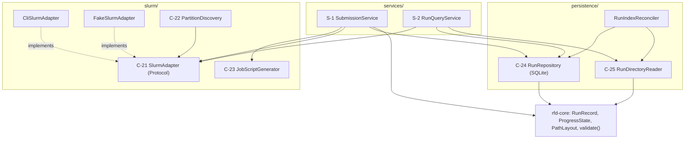

# U3 Slurm and Persistence — Business Logic Model

**Unit**: U3 (`packages/rfd-web/src/rfd_web/{slurm,persistence,services}`)
**Stage**: CONSTRUCTION — Functional Design
**Date**: 2026-08-27
**Answers applied**: Q1=A, Q2=A, Q3=A, Q4=A, Q5=A, Q6=A, Q7=A, Q8=A (all recommended options)

This unit turns the CLI pipeline proven by Milestone M1 into something a program can submit, track,
cancel and resubmit. It contains **no HTTP**. Everything here is callable from a test with no
cluster present.

---

## 1. Three Facts That Shape This Design

### 1.1 The job and the web app never talk to each other

They are different processes on different nodes. Their only channel is the run directory on `/home`
plus the Slurm controller. Every question the UI asks is therefore answered by **reconciling four
sources that can disagree**: the SQLite index, `run.json`, `progress.json`, and live Slurm. Deciding
which one wins, case by case, is the substance of this unit — `services.md` deferred exactly that
question to here.

### 1.2 `scancel` makes two sources contradict each other (finding F-3)

`scancel` sends SIGTERM. The runner's handler (`orchestrator.py:294-303`) writes
`backbone_state = FAILED` with `error = "terminated (SIGTERM) — likely walltime exceeded"` and exits
1. So after a user presses Cancel, Slurm says `CANCELLED` and `run.json` says the run crashed on
walltime. Both are literally true from where they sit; only reconciliation can produce the honest
answer. Per **Q6=A**, Slurm decides the *kind* of ending and `run.json` supplies detail — with the
runner's walltime sentence suppressed when Slurm reports a cancel, because in that case it is wrong.

### 1.3 `progress.json` stops updating when BACKBONE ends

Verified on the M1 pass: `ProgressReporter` is wired into `_run_backbone` only; `_run_validate`
(`orchestrator.py:222-263`) never touches it. A run in its validation stage therefore shows a
**frozen** `progress.json` — last write `stage: "backbone", step: 49/50`. A naive status view would
render that as a stalled progress bar for the whole validation stage. Section 5.4 handles it
explicitly rather than leaving U4 to discover it.

---

## 2. Component Map



**Text alternative**: The `services/` layer holds two services. `SubmissionService` collaborates with
`JobScriptGenerator`, `SlurmAdapter`, `RunRepository` and `rfd-core`. `RunQueryService` collaborates
with `SlurmAdapter`, `RunRepository` and `RunDirectoryReader`. `PartitionDiscovery` collaborates with
`SlurmAdapter`. Two adapters implement the `SlurmAdapter` protocol: `CliSlurmAdapter` (real
subprocesses) and `FakeSlurmAdapter` (tests and offline development). `RunIndexReconciler` rebuilds
the SQLite index from run directories. Both persistence components read the `rfd-core` contracts.

---

## 3. C-21 `SlurmAdapter` — the only place a subprocess is spawned

Every Slurm command is invoked with an **argument list and `shell=False`** (D-1, NFR-11), with
stdout and stderr captured separately and the exit code checked (NFR-13), under a per-call timeout
(default 30 s, `RFD_SLURM_TIMEOUT_SECONDS`) so a wedged controller cannot hang a login-node process
(NFR-15).

| Operation | Command | Parse |
|---|---|---|
| `submit` | `sbatch --parsable <script>` with `cwd=run_dir` | stdout is the bare job id (`12345` or `12345;cluster`); take the part before `;`. `--parsable` is used precisely so the `sbatch: WARNING/INFO` lines seen during M1 stay on stderr and never have to be parsed out |
| `status` (live) | `squeue -h -j <id> -o "%T"` | one word; empty stdout means the job has left the queue |
| `status` (historic) | `sacct -n -P -X -j <id> -o State,ExitCode` | `-X` keeps allocation rows only, so the `.batch`/`.extern` rows M1's `sacct` output showed are not mistaken for separate jobs; `-P` gives `|`-delimited fields; `State` may read `CANCELLED by 1234`, so the first token is taken |
| `cancel` | `scancel <id>` | exit 0, or a "job not found" stderr treated as success (BR-11) |
| `partitions` | `sinfo -h -o "%R\|%G\|%l\|%a"` | one row per partition/node-state group, so rows are de-duplicated by name |

**Query order** (services.md): `squeue` first, `sacct` second — the live queue is cheap and
authoritative while the job exists; `sacct` is the only source once it does not.

**Refinement R-1 to the Application Design signature.** `component-methods.md` gives
`state(job_id) -> SlurmState`, which cannot carry the Slurm **exit code** that FR-19 requires. The
protocol method is therefore `status(job_id) -> JobStatus`, where `JobStatus` carries `state`,
`exit_code` and `reason`. This is a deliberate, documented widening (NFR-9), not a drift.

**Absent versus unavailable — a distinction the reconciler depends on.** Both are surfaced, and they
are not the same thing:

- both commands ran and returned **no row** ⇒ `JobStatus(state=UNKNOWN, known=False)` — Slurm has
  genuinely forgotten this job (accounting retention).
- a command **failed, timed out, or was not found on `PATH`** ⇒ raises `SlurmUnavailable` — the
  cluster is unreachable or the app is not on a login node.

Collapsing these into one value is how a status page ends up claiming a running job vanished during
a controller restart.

### 3.1 State mapping

Slurm has far more states than the seven the Application Design defines. The mapping is explicit and
total, with `UNKNOWN` as the fallback — a state nobody anticipated must never be silently read as
success:

| Slurm reports | Mapped to | Note |
|---|---|---|
| `PENDING`, `CONFIGURING`, `REQUEUED`, `RESV_DEL_HOLD`, `SUSPENDED` | `PENDING` | queued or not yet executing |
| `RUNNING`, `COMPLETING`, `STAGE_OUT` | `RUNNING` | `COMPLETING` is still occupying the allocation |
| `COMPLETED` | `COMPLETED` | **never** on its own sufficient to report success — see BR-2 |
| `FAILED`, `NODE_FAIL`, `BOOT_FAIL`, `OUT_OF_MEMORY`, `DEADLINE`, `PREEMPTED` | `FAILED` | the specific word is kept in `JobStatus.reason` so FR-19 can show it |
| `CANCELLED`, `CANCELLED by <uid>` | `CANCELLED` | |
| `TIMEOUT` | `TIMEOUT` | distinct from `FAILED` per NFR-10 |
| anything else, or no row | `UNKNOWN` | |

### 3.2 `FakeSlurmAdapter`

Ships in `slurm/fake.py`, not in the test tree, so U4 can run the whole app offline against it. It
holds a scripted queue: `submit` returns increasing ids and records the script path, `status` walks a
programmed state sequence, `cancel` moves a job to `CANCELLED`, `partitions` returns a fixture.
U3's definition of done — *"the full suite passes against a fake Slurm with no cluster access"* — is
this class plus D-5.

---

## 4. C-22 `PartitionDiscovery` — discovered, annotated, never hard-coded

**Q3=A.** `discover_partitions(adapter, config)` calls `sinfo`, keeps rows where the GRES column
mentions `gpu`, de-duplicates by partition name, and then **annotates** each with compatibility.

The incompatibility list is **configuration, not code**: `RFD_INCOMPATIBLE_PARTITIONS`, defaulting
to `lgpu`. FR-6a is satisfied because the partition list itself is discovered at runtime — nothing in
the codebase asserts which partitions exist. What the config adds is a warning on partitions the
*current image* cannot use, which is a property of the image, not of the cluster. `env.example`
already records the verified fact behind the default: the Phase 1 CUDA 11.6 image runs on `gpu`,
`stamps-b`, `livi-b` (V100, sm_70) and `agpu`, `mcordgpu-b` (A30, sm_80), but not on `lgpu`
(L40s, sm_89).

Incompatible partitions are **listed and selectable**, carrying an explanatory
`incompatible_reason`. They are not filtered out: the image is the user's to replace, and a filter
that silently removes a valid option is the same failure mode as a hard-coded list.

**Caching**: results are cached for `RFD_PARTITION_CACHE_SECONDS` (default 300). Partition
topology changes on the scale of cluster maintenance, not page loads (NFR-15, NFR-16).

**Degradation**: if `sinfo` raises `SlurmUnavailable`, discovery returns an empty list plus a
warning. The caller (U4's form) then falls back to a free-text partition field pre-filled from
`RFD_DEFAULT_PARTITION`. Discovery failing must never block submission — R-6's "queue wait looks like
a stall" lesson applies to the form too.

---

## 5. C-23 `JobScriptGenerator` — emitting the script M1 proved

**Q2=A.** The generator emits the shape of `scripts/m1-submit.sh`, the only version of this script
with a successful real execution behind it, **not** the `deployment-architecture.md` section 3
template — whose runner invocation cannot work (finding F-1: `--run-dir` and `--scratch` do not
exist, and `python3.9` is not the container's interpreter). Section 3 is corrected to match as a
step of this stage, so the two cannot drift apart again.

Two things carry over from the M1 template rather than the M1 script, deliberately:

1. **Log files go into the run directory** — `#SBATCH --output={run_dir}/job-%j.out` and
   `--error={run_dir}/job-%j.err`. The hand-written script wrote `%x-%j.out` into the submission
   directory, which is fine for one manual smoke test and useless to `RunDirectoryReader`, which has
   to find the log for FR-19 from the run directory alone.
2. **The `{run_dir}` interpolation is literal**, not a `$1` argument. A generated script belongs to
   exactly one run and must be resubmittable by hand with a bare `sbatch job.sh` (G-2).

### 5.1 Emitted structure

```
#!/bin/bash
#SBATCH --job-name=rfd-{run_id}
#SBATCH --partition={partition}
#SBATCH --gpus={gpus}
#SBATCH --nodes=1
#SBATCH --ntasks=1
#SBATCH --cpus-per-task={cpus_per_task}
#SBATCH --mem-per-cpu={mem_per_cpu}
#SBATCH --time={walltime}
#SBATCH --output={run_dir}/job-%j.out
#SBATCH --error={run_dir}/job-%j.err
[#SBATCH --account={account}]        <- emitted only when an account is configured
# NOTE: --qos is deliberately never emitted (Grex docs: "Not to be used on Grex!")

set -u                                <- no `set -e`: the exec must be allowed to fail so rc survives

cd "${SLURM_SUBMIT_DIR:-{run_dir}}"

echo "Starting run at: $(date)"
echo "Job ID: ${SLURM_JOB_ID:-none} on host: $(hostname)"

export TMPDIR=${TMPDIR:-/tmp}
export SLURM_TMPDIR=$TMPDIR
mkdir -p "$TMPDIR"
export APPTAINER_CACHEDIR={cache_dir}
export SINGULARITY_CACHEDIR={cache_dir}

module load singularity 2>/dev/null || module load apptainer 2>/dev/null || true
ENGINE=$(command -v singularity || command -v apptainer || true)
[ -n "$ENGINE" ] || { echo "ERROR: no singularity/apptainer on PATH (G-15)" >&2; exit 127; }
echo "Engine: $ENGINE ($($ENGINE --version 2>&1))"

for p in {image_path} {run_dir}/run.json; do
  [ -f "$p" ] || { echo "ERROR: required path missing: $p" >&2; exit 2; }
done
[ -d {weights_root} ] || { echo "ERROR: weights dir missing" >&2; exit 2; }

nvidia-smi

"$ENGINE" exec --nv \
  --bind {project_root}:/opt/rfdgui:ro \
  --bind {weights_root}:/opt/weights:ro \
  --bind {run_dir}:/opt/outputs/run \
  --bind "$TMPDIR":/scratch \
  {image_path} \
  /app/RFdiffusion/.venv/bin/python -m rfd_runner /opt/outputs/run --stage {stage}

rc=$?
echo "Job finished with exit code $rc at: $(date)"
exit $rc
```

Every interpolated value is emitted through `shlex.quote` **after** passing the character whitelist
of BR-12 — these values originate in a web form, and a generated shell script is the one place in
this system where a string becomes executable.

### 5.2 Why engine detection, not a binary name

M1 job 7556080 died at exit 127 with `apptainer: command not found` before the container ever
started, because the hand-written script named the CCEnv binary while Grex's `singularity` module
provides `singularity`. It cost a GPU allocation to find something not GPU-dependent at all. The
generator emits **detection**; naming a binary is prohibited by BR-13.

### 5.3 Testability against a fake engine

`generate_job_script(record, layout, stage) -> str` is **pure** — a string in, a string out, no
filesystem — so the `#SBATCH` block and the exec argv can be asserted directly. `write_job_script`
is the only part that touches disk. On top of that, the tests execute the generated script with a
stub `singularity`/`apptainer` on `PATH` that echoes its argv, covering the four scenarios the M1
fix was verified against: only `singularity` present, only `apptainer` present, neither present
(exit 127 with the G-15 message), and a missing `run.json` (exit 2 before the exec). This is the
second M1 lesson carried in by `aidlc-state.md`, and it is a requirement of this design, not an
optional extra.

---

## 6. C-24 `RunRepository` and C-25 `RunDirectoryReader`

**The SQLite database is an index, never the source of truth** (D-3, AD-6). It exists to answer the
run-list query (FR-27) without stat-ing a thousand directories, and to cache terminal states so a
finished run never triggers another `sacct`. Every field in it is derivable from a run directory,
which is what makes **Q5=A** safe.

`RunDirectoryReader` reads the `rfd-core` contracts (`RunRecord.load`, `ProgressState.load`) plus
the outputs, and enforces **path containment** on every path it resolves: the resolved path must be
inside the run directory or the read is refused (BR-14). That rule lives here, at the bottom, rather
than in U4's file endpoint, so no future route can bypass it.

`log_tail` (**Q7=A**): read the newest `job-*.err` in the run directory; if it is missing or empty,
fall back to the newest `job-*.out`. Newest-by-mtime matters because a resubmission (section 8)
leaves the earlier job's logs in place. The read is bounded — at most 64 KB from the end of the file
— so a runaway log cannot be pulled into a login-node process's memory (NFR-15).

### 6.1 Startup reconciliation (Q5=A)

`RunIndexReconciler.reconcile_all()` runs at application startup:

1. Iterate `layout.output_root`; for every subdirectory containing a readable `run.json`, upsert the
   derived `RunSummary` into SQLite.
2. Rows whose `run_dir` no longer exists are marked `missing = 1` — **not deleted**. A deleted row
   destroys the only trace that a run ever happened; a flagged row lets the UI say so.
3. An unreadable or invalid `run.json` is skipped with a warning. One corrupt directory must never
   prevent the app from starting.

This is what actually delivers FR-29 and gives FR-33's self-describing run directories a reader: a
deleted database costs nothing, and a run directory copied in from elsewhere appears after a restart.

---

## 7. S-1 `SubmissionService` (Q1=A)

Built here, minus the browser upload step — it accepts an **already-resolved template path**, and U4
adds only `TemplateUploadHandler` in front of it. Without this, U3's definition of done is
unreachable and the unit stays unverifiable until U4 lands.

```
submit(request: DesignRequest, template_path: Path | None) -> SubmissionOutcome
```

1. **Validate first** — `rfd_core.validate(request)` (finding F-5: C-26 already exists; U3 does not
   reimplement it). If not `ok`, return the rejection **having created nothing**: no directory, no
   record, no job, no GPU consumed (FR-5, G-9).
2. **Derive `run_id`** and create the directory (section 7.1).
3. **Copy the template** into `{run_dir}/input_template.pdb`, if one was given.
4. **Write the initial `RunRecord`** with both stage states `PENDING` (FR-28).
5. **Generate and write `job.sh`** into the run directory (G-2).
6. **Submit** via `sbatch` with `cwd = run_dir`.
7. **Record the job id** and index the run in SQLite.

**Ordering is deliberate.** The run directory and `run.json` exist before `sbatch` is called, so a
job that starts instantly still finds its own record. The SQLite insert is last because it is the
only step that can be reconstructed if it fails (section 6.1).

**Submission failure** (NFR-10): the record is retained with `backbone_state = FAILED` and the real
`sbatch` stderr in `error`. The user sees *why*, not merely that nothing happened. The run directory
is deliberately **not** cleaned up — a failed submission with its script still in place is
diagnosable and hand-resubmittable.

### 7.1 Run id derivation (Q4=A)

`PathLayout.run_dir(run_id)` makes `run_id` the directory name, so it must be filesystem-safe:

1. Sanitise: replace every character outside `[A-Za-z0-9._-]` with `-`, collapse runs of `-`, strip
   leading and trailing `-` and `.`, truncate to 64 characters, and fall back to `run` if nothing
   remains. (`rfd_core.validate` has already rejected names containing path separators.)
2. Attempt `run_dir.mkdir(parents=True, exist_ok=False)`. **The `mkdir` itself is the collision
   test** — checking `exists()` first and then creating is a race, and this is the notebook's own
   "append a suffix if taken" behaviour made correct.
3. On `FileExistsError`, append `_` plus 4 hex characters from `secrets.token_hex(2)` and retry, up
   to 8 attempts, then fail with a clear message.

`my-binder`, then `my-binder_a3f9` — human-meaningful directory names, notebook parity, and no
possibility of two runs sharing a directory.

---

## 8. Resubmission (Q8=A)

```
resubmit(run_id, stage=Stage.VALIDATE) -> SubmissionOutcome
```

FR-11 built `--stage {all,backbone,validate}` into the runner precisely so a failed validation can be
retried without repeating backbone generation. Nothing in the system called it; this is that caller.

**Preconditions**, all checked before anything is written: the record exists; `backbone_state` is
`COMPLETED`; and the run has no live job (its reconciled status is terminal). Submitting a second job
against a run directory a live job is still writing to would corrupt it.

**Sequence**: reset `validate_state = PENDING`, clear `error` and `finished_at`, save the record;
generate and write `job-validate.sh` **alongside** `job.sh` (D-6 — the original script is never
overwritten, so the run stays reproducible exactly as first submitted); `sbatch`; store the new job
id in `RunRecord.slurm_job_id` and clear the index's terminal flag.

**The previous job id is preserved in the index only** — a `job_id_history` column on the SQLite row.
`RunRecord` is an approved `rfd-core` model with a single `slurm_job_id` field, and this unit does
not reopen it for a convenience. The job logs of both attempts remain in the run directory, and
`log_tail`'s newest-first rule (section 6) resolves to the right one.

---

## 9. S-2 `RunQueryService` — the reconciler

The only place in the system that answers "which source wins". Scattering this across routes is how
status displays start lying, which is why `services.md` isolates it.

```
get(run_id) -> RunView | None
```

### 9.1 Algorithm

1. Load the indexed row (C-24); fall back to `run.json` (C-25). Neither ⇒ `None`.
2. **If the index row is marked terminal, return immediately** from cached state plus the run
   directory. No Slurm call is made for a finished run, ever (D-4, BR-3).
3. If `slurm_job_id` is unset, the job was never queued: report from the record alone — a `FAILED`
   record here is a submission failure, and its `error` is the `sbatch` stderr.
4. Query Slurm (C-21). `SlurmUnavailable` ⇒ return the last known view marked `stale = True` with an
   explanatory message; **never** invent a state, and never downgrade a running job to failed
   because the controller was briefly unreachable.
5. Re-read `run.json` from disk — the compute node may have written it since the index was last
   touched, so the file is always newer than the index.
6. Apply the reconciliation table (section 9.2).
7. Overlay `progress.json` only where section 9.3 permits.
8. If the reconciled status is terminal, **write it back** to the index once (state, exit code,
   `terminal = 1`) so step 2 short-circuits every later read.

### 9.2 Reconciliation table

`finalised` means `run.json` records a terminal state for the stage that was supposed to run —
`COMPLETED`, `FAILED`, `CANCELLED` or `SKIPPED` — and not `PENDING` or `RUNNING`.

| Slurm | `run.json` | Reported | Detail shown |
|---|---|---|---|
| `PENDING` | any | **QUEUED** | Queue position/reason from `squeue` where available. No progress is expected yet; `progress.json` is ignored entirely |
| `RUNNING` | any | **RUNNING** | Stage and step per section 9.3 |
| `COMPLETED` | finalised, `error` null | **COMPLETED** | Outputs from `RunOutputs` |
| `COMPLETED` | **not** finalised | **FAILED** | *"the job ended without writing a terminal run record"* plus the log tail. **Never reported as success** — services.md's central rule, and the reason this service exists |
| `COMPLETED` | finalised with `error` | **FAILED** | The runner's own `error`, plus log tail. The runner caught its failure and exited 0 for Slurm's purposes; the record is authoritative about the science |
| `FAILED` | any | **FAILED** | `run.json`'s `error` when present, else the log tail; Slurm exit code from `sacct` (FR-19) |
| `CANCELLED` | any | **CANCELLED** | **Q6=A** — the runner's *"likely walltime exceeded"* sentence is suppressed here, because Slurm has established that it is wrong. If `cancel_requested_at` is set, *"cancelled from this app at HH:MM"*; otherwise *"cancelled by the scheduler or an administrator"* |
| `TIMEOUT` | any | **TIMEOUT** | The runner's message is **kept** — here it is accurate — plus the walltime that was requested |
| `UNKNOWN`, `known=False` | finalised | that record's outcome | Trust the record; Slurm has simply forgotten the job |
| `UNKNOWN`, `known=False` | not finalised | **UNKNOWN** | *"the scheduler no longer has a record of job N, and the run never wrote a final state"* plus the log tail |

### 9.3 Progress overlay, and the frozen-`progress.json` case

`progress.json` is authoritative for **within-stage** progress and for nothing else. It is read only
when the reconciled status is `RUNNING`, and then interpreted against fact 1.3:

| Condition | Displayed |
|---|---|
| `progress.json` absent | *"starting"* — the job has an allocation but the runner has not reached its first step |
| present, `updated_at` fresh (within `RFD_PROGRESS_STALE_SECONDS`, default 120) | step *n* of *N*, design *i* of *M*, stage from the file |
| present, stale, and `run.json` says `backbone_state = COMPLETED` | **"validating (no step-level progress available)"** — this is the expected state during ProteinMPNN/AlphaFold, **not** a stall |
| present, stale, backbone not completed | *"running — no progress update for X minutes"*, shown as a warning rather than a frozen bar |

The third row is the M1 finding recorded in `aidlc-state.md` as a U4 prerequisite, resolved here so
U4 inherits a correct answer instead of rediscovering a frozen progress bar.

`RunView.frame_available` is derived from **`current_frame.pdb` existing on disk**, not from
`ProgressState.frame_path` — the second M1 finding was that `set_frame()` is never called, so
`frame_path` stays `null` for the entire run while the file itself is published correctly. Reading
the field would break FR-17's live preview for no reason.

---

## 10. Cancellation (FR-14)

```
cancel(run_id) -> None
```

1. Write `cancel_requested_at` to the index **before** calling `scancel` (Q6=A). A crash between the
   two steps then still leaves the evidence that a human asked for this, which is the whole point of
   the field.
2. `scancel <job_id>`.
3. Do **not** write a terminal state locally. Slurm owns the job's ending; the next `get()` reads
   `CANCELLED` and reconciles it. Writing it optimistically here would mean a failed `scancel`
   produces a run the UI shows as cancelled while it keeps consuming a GPU.

Cancelling a job that has already finished is a **no-op, not an error** (BR-11): `scancel` on a
completed job exits non-zero, and the user's intent is satisfied either way.

---

## 11. Traceability

| Requirement | Where satisfied |
|---|---|
| FR-6, NFR-8 | Job script `#SBATCH` block, section 5.1; defaults from `RFD_DEFAULT_*` |
| FR-6a | Section 4 — `sinfo` discovery, no partition list in code |
| FR-7 | Section 7.1 — sanitise, `mkdir` as the collision test, random suffix |
| FR-11 | Section 8 — `resubmit` |
| FR-14 | Section 10 |
| FR-15, FR-18 | Sections 9.2, 9.3 |
| FR-19 | `JobStatus.exit_code`, `log_tail` (Q7=A), the FAILED/TIMEOUT/UNKNOWN rows of 9.2 |
| FR-27, FR-28 | `RunRepository.list`, SQLite schema (domain-entities.md §5) |
| FR-29 | Section 6.1 — startup reconciliation |
| FR-33 | Section 6.1 reads run directories back, which is what makes them self-describing in practice |
| NFR-10 | Distinct QUEUED / FAILED / CANCELLED / TIMEOUT / UNKNOWN outcomes, section 9.2 |
| NFR-11, NFR-13 | Section 3 — argument lists, no shell, exit codes checked |
| NFR-16 | D-4 poll defaults, section 4 partition cache, D-4 terminal-state cache |
| NFR-18 | Section 3.2 — `FakeSlurmAdapter` behind the C-21 protocol |
| G-1 … G-18 | Section 5.1; the conformance obligations are enumerated in business-rules.md §6 |
