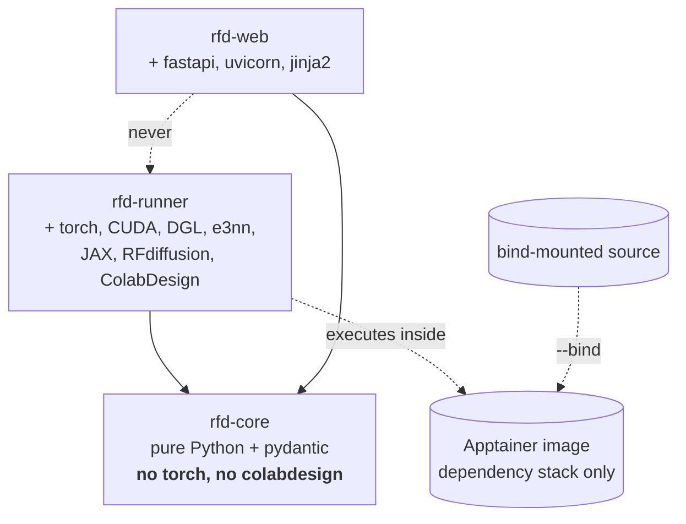
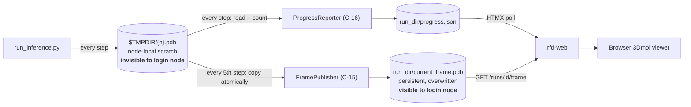

# Component Dependencies

---

## Package Dependency Graph

**Text alternative**: Both `rfd-runner` and `rfd-web` depend on `rfd-core`. `rfd-web` must never
depend on `rfd-runner` — that edge is what would drag PyTorch into the login-node environment. The
runner executes inside the Apptainer image, which supplies only the dependency stack; the runner's
own source is bind-mounted at runtime rather than baked in.

**The one rule that matters**: `rfd-web` → `rfd-core` only. The workspace layout (Q1 = A) makes this
resolver-enforced rather than a convention, which is why it was worth three packages instead of one.

---

## Component Dependency Matrix

`→` = depends on. Components are listed only where they have outbound dependencies.

### `rfd-core` (internal only — no outbound package dependencies)

| Component | Depends on |
|---|---|
| C-2 `DesignModeInferrer` | C-1 `ContigSpec` |
| C-5 `InferenceArgvBuilder` | C-1, C-3, C-4, C-6 |
| C-7 `RunRecord` | C-6 `DesignRequest`, C-9 `AtomicJsonStore` |
| C-8 `ProgressState` | C-9 `AtomicJsonStore` |

### `rfd-runner`

| Component | Depends on |
|---|---|
| C-13 `ContigNormaliser` | C-1, C-2 · **ColabDesign**, RFdiffusion `parse_pdb` |
| C-12 `SymmetryDetector` | C-3 · `ananas` binary, ColabDesign `sym_it` |
| C-14 `InferenceExecutor` | C-5 · `run_inference.py` subprocess |
| C-15 `FramePublisher` | C-9 · `$TMPDIR` |
| C-16 `ProgressReporter` | C-8, C-9 |
| C-17 `PdbPostProcessor` | ColabDesign `fix_pdb` |
| C-18 `ValidationExecutor` | C-6 · `designability_test.py` subprocess |
| C-20 `PipelineOrchestrator` | C-1 … C-19 (all) |

### `rfd-web`

| Component | Depends on |
|---|---|
| C-22 `PartitionDiscovery` | C-21 `SlurmAdapter` |
| C-23 `JobScriptGenerator` | C-7, C-10 |
| C-24 `RunRepository` | C-7 · SQLite |
| C-25 `RunDirectoryReader` | C-7, C-8, C-9, C-10 |
| C-26 `RequestValidator` | C-1, C-2, C-6 |
| C-28 `Routes` | S-1, S-2, S-3, C-29 |

---

## Communication Patterns

| # | From → To | Mechanism | Rationale |
|---|---|---|---|
| **1** | Browser → `rfd-web` | HTTP (HTML + HTMX fragments) | localhost only, behind SSH tunnel (NFR-14, AD-7) |
| **2** | `rfd-web` → Slurm | `subprocess` with **argument lists**, no shell | NFR-11; eliminates TD-7 |
| **3** | `rfd-web` → run directory | Filesystem reads (`run.json`, `progress.json`, PDBs) | Web app never writes to a run directory after submission |
| **4** | Slurm → `rfd-runner` | Job script executes `apptainer exec --nv --bind` | G-15, G-17, Q2 = A |
| **5** | `rfd-runner` → run directory | Atomic filesystem writes | Single writer during job execution |
| **6** | `rfd-runner` → `run_inference.py` / `designability_test.py` | `subprocess`, argument lists | NFR-11, NFR-13 |
| **7** | `run_inference.py` → `rfd-runner` | Per-step PDB dumps in `$TMPDIR` + trailing-`TER` completeness check | G-11; carried over from the notebook |
| **8** | `rfd-runner` internal, stage → stage | **In-memory Python variables** | AD-5 — this is the whole point of the single-job design |

### Ownership rules

- **The run directory has exactly one writer at a time.** `rfd-web` writes it at submission; from job
  start to job end, `rfd-runner` is the sole writer. No locking needed because the windows do not
  overlap.
- **`run.json` is durable, `progress.json` is volatile.** Losing the latter costs a progress bar;
  losing the former would lose the run. Kept separate for exactly that reason (Q4 = A).
- **Both are written atomically** (temp + `os.replace`), so a reader on the login node never observes
  a partial file even though writes come from another node over NFS.

---

## Data Flow: Live Progress (the FR-17 / G-11 bridge)

**Text alternative**: `run_inference.py` writes a PDB per timestep into `$TMPDIR` on the compute node,
which the login node cannot see. Every step, `ProgressReporter` reads and counts these to update
`progress.json` on persistent storage. Every fifth step, `FramePublisher` atomically copies the
current frame to `current_frame.pdb` on persistent storage. The web app polls `progress.json` for the
step counter and fetches `current_frame.pdb` for the structure, serving both to the browser's 3Dmol
viewer. Bulk trajectory data stays on node-local scratch until final stage-out.

**Why the step counter and the frame update at different rates**: counting is a cheap local operation
on the compute node and its result rides in a file already being written; copying a frame is a
cross-filesystem write. Decoupling them keeps the progress bar smooth at N=5 while cutting frame I/O
by 80%.

---

## Coupling Assessment

| Boundary | Coupling | Assessment |
|---|---|---|
| `rfd-web` ↔ `rfd-core` | Low | Models and pure functions only |
| `rfd-runner` ↔ `rfd-core` | Low | Same |
| `rfd-web` ↔ `rfd-runner` | **None** | Enforced by the workspace; the critical boundary |
| `rfd-web` ↔ Slurm | Low | Behind the C-21 `Protocol`; fakeable (NFR-18) |
| `rfd-runner` ↔ ColabDesign | **High** | Unavoidable — concentrated in C-13, C-12, C-17 so the blast radius of an upstream change is three components, not the whole codebase |
| `rfd-runner` ↔ RFdiffusion CLI | Medium | Concentrated in C-5 (argv construction) and C-14 (execution) |
| Runner ↔ Web | **Very low** | Communicate only through two `rfd-core`-defined file formats |

**Highest-risk coupling** is `rfd-runner` ↔ ColabDesign/RFdiffusion — the same coupling that makes R-1
and R-2 the project's top risks. The mitigation is structural: it is confined to four components
(C-12, C-13, C-14, C-17), all inside the container, none reachable from the web app. If an upstream
change breaks something, the failure is contained and diagnosable rather than diffuse.
