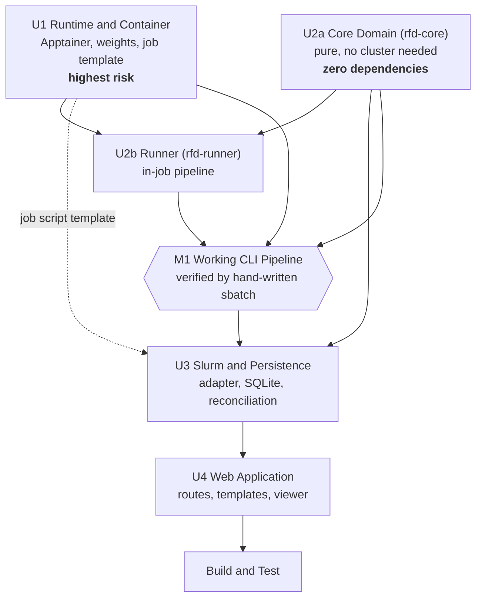

# Unit of Work Dependencies

---

## Dependency Graph



**Text alternative**: U2a has no dependencies and can start immediately. U1 also has no code
dependencies and can start immediately, in parallel. U2b needs both — U1 for an environment to run
in, U2a for the domain logic it orchestrates. Milestone M1 gates on U1, U2a and U2b together. U3
depends on U2a for models and on U1 for the job-script template, and begins after M1. U4 depends on
U3. Build and Test follows U4.

---

## Dependency Matrix

`✓` = depends on · `(t)` = template/artifact dependency only, not code

| ↓ depends on → | U1 | U2a | U2b | U3 | U4 |
|---|---|---|---|---|---|
| **U1** Runtime and Container | — | | | | |
| **U2a** Core Domain | | — | | | |
| **U2b** Runner | ✓ | ✓ | — | | |
| **U3** Slurm and Persistence | (t) | ✓ | | — | |
| **U4** Web Application | | ✓ | | ✓ | — |

**No cycles.** **U4 never depends on U2b** — the boundary that keeps PyTorch out of the login-node
environment (NFR-2), enforced by the workspace resolver.

---

## Build Order and Parallelisation

### Phase A — parallel start (no dependencies)

| Track | Unit | Blocked by | Notes |
|---|---|---|---|
| **A1** | **U1** Runtime and Container | nothing | Long pole. Image build + a GPU allocation to validate. **User-in-the-loop.** |
| **A2** | **U2a** Core Domain | nothing | Pure Python. Completes fully — including property tests — with no cluster access. |

**This parallelism is the whole point of the Q1 = A split.** A1 is dominated by wall-clock time you
don't control (image builds, GPU queue); A2 is dominated by work that can proceed regardless. Running
them concurrently is the single largest schedule lever available.

### Phase B — U2b Runner
Blocked by A1 **and** A2. Development can begin against U2a as soon as A2 lands; *verification*
requires A1.

### Milestone M1 — Working CLI Pipeline
Gate. Hand-written `sbatch`, real design, real GPU node. See exit criteria in `unit-of-work.md`.

### Phase C — U3 Slurm and Persistence
Blocked by M1 (needs the proven job script and a real `run.json` to read). Its own test suite runs
against a **fake Slurm**, so most of U3 is verifiable without further cluster access.

### Phase D — U4 Web Application
Blocked by U3.

### Phase E — Build and Test
Full end-to-end on a real Grex GPU allocation.

---

## Critical Path

```
U1 ──────────────────┐
                     ├──> U2b ──> M1 ──> U3 ──> U4 ──> Build and Test
U2a ─────────────────┘
```

**U1 is on the critical path and is the schedule.** If the GPU dependency stack resolves quickly,
everything downstream is short. If R-1/R-2 bite, U1 dominates — which is precisely why it starts in
Phase A and why U2a was split out to run alongside it.

**U2a is deliberately *off* the critical path.** That is the value of the split: the project's most
valuable and most testable code is never waiting on its riskiest dependency.

---

## Coordination Points

| # | Contract | Producer | Consumer | Fixed during |
|---|---|---|---|---|
| **1** | `RunRecord` / `run.json` schema | U2a (defines) | U2b (writes), U3/U4 (read) | U2a Functional Design — **must not drift after** |
| **2** | `ProgressState` / `progress.json` schema | U2a (defines) | U2b (writes), U3/U4 (read) | U2a Functional Design |
| **3** | `current_frame.pdb` location and atomic-replace semantics | U2b | U3/U4 | U2b Functional Design (DD-6) |
| **4** | `#SBATCH` job-script template | U1 | U3 (generates programmatically) | U1 Infrastructure Design |
| **5** | Container path layout and bind-mount points | U1 | U2b, U3 | U1 Infrastructure Design |
| **6** | `--stage` CLI contract | U2b | U3 (invokes in the script) | U2b Functional Design |
| **7** | Normalised contigs and copies in `RunRecord` | U2b | U4 (chain colouring via `get_Ls`) | U2a schema, U2b population |

**Contracts 1 and 2 are the highest-consequence.** They span a process *and* a node boundary — written
on a compute node, read on a login node. Both are defined in `rfd-core` precisely so neither side can
change them unilaterally, and both are versioned so a stale run directory is detected rather than
silently misread.

---

## Testing Checkpoints

| # | After | Verification | Cluster needed |
|---|---|---|---|
| **T1** | U2a | Unit + property tests; all four notebook protocols produce correct Hydra overrides | **no** |
| **T2** | U1 | Container runs `run_inference.py` on a GPU node; trivial design completes | **yes** |
| **T3** | M1 | Full pipeline via hand-written `sbatch`; job script reviewed against Grex docs | **yes** |
| **T4** | U3 | Submission, tracking, cancellation against a fake Slurm; then one real trivial job | mostly no |
| **T5** | U4 | End-to-end: one click → queued → live progress → structure → download | **yes** |

T1 and T4 need no GPU allocation, which matters: the majority of the test surface is verifiable
without competing for two GPU nodes.

---

## Rollback Strategy

`reference/diffusion.py` is never modified and remains a working Colab fallback throughout (DD-5).

Each unit is **additive**, and failure at any point leaves earlier units intact and independently
useful:

| Failure at | You still have |
|---|---|
| U1 | Nothing gained — but nothing lost; the Colab notebook still works |
| U2a | A tested pure-Python contig/flag library, useful on its own |
| U2b | — |
| **M1** | **A working CLI pipeline on Grex** — genuinely useful without any web UI |
| U3 | CLI pipeline plus programmatic submission and tracking |
| U4 | The complete deliverable |

M1 is the point at which the project becomes useful even if everything after it stalls. That is a
deliberate property of the sequencing, not an accident.
