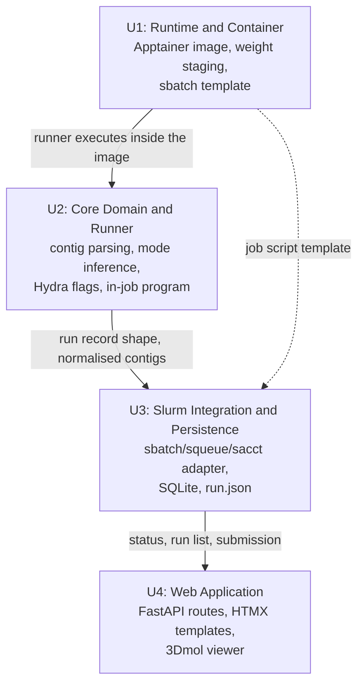
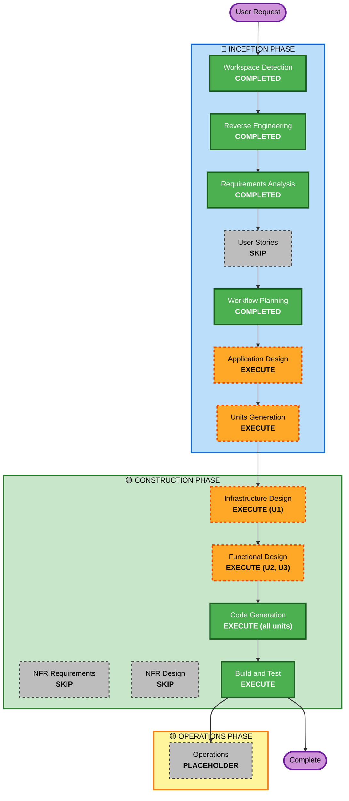

# Execution Plan

**Date**: 2026-07-31
**Project**: rfdiffusion-gui — Colab notebook → uv-managed, Slurm-backed web application for Grex HPC
**Overriding priority**: Speed (*"I need this working ASAP"*), subject to strict Grex documentation adherence

---

## 1. Detailed Analysis Summary

### 1.1 Transformation Scope (Brownfield)

- **Transformation Type**: **Architectural transformation**, not a component change. The source is a
  single 596-line Colab notebook export with no build system, no packaging, and no tests. The target
  is a multi-module application with a web tier, a domain library, a Slurm integration layer, a
  containerised GPU runtime, and a persistence layer.
- **Primary Changes**:
  - Execution model: interactive notebook cells → **submit-and-track Slurm batch jobs**
  - Dependency model: runtime `os.system("pip install …")` → **`uv` lockfile + Apptainer image**
  - Presentation: `ipywidgets` + `py3Dmol` → **FastAPI + HTMX + vendored 3Dmol.js**
  - State: Python globals across cells → **SQLite index + per-run `run.json`**
  - I/O: `google.colab.files` → **HTTP upload/download**
  - Scratch: `/dev/shm/{n}.pdb` → **`$TMPDIR`** (Grex-documented per-job node-local scratch)
- **Related Components**: none — there is no existing infrastructure code, CDK, CI, or test suite to
  update. Everything is new construction except the ~120 lines of design logic being preserved.
- **Code carried forward**: `run_diffusion()` and the contig mode-inference block, ported with
  behaviour preserved (FR-12).

### 1.2 Change Impact Assessment

| Impact area | Yes/No | Description |
|---|---|---|
| **User-facing changes** | **Yes** | Complete replacement of the interaction model — notebook cells become a web form, a run list, live progress, and in-browser 3D viewers. Every business transaction (BT-1…BT-7) is affected. |
| **Structural changes** | **Yes** | Flat single-file script → layered application with explicit module boundaries. This is the core of the work. |
| **Data model changes** | **Yes** | Introduces the first explicit data models in the project: the design-request model, the run record (SQLite + `run.json`), and the parsed-contig model. The notebook had none. |
| **API changes** | **Yes** (new) | Creates the first HTTP surface — no API existed to break. |
| **NFR impact** | **Yes** | Reproducibility (lockfile + pinned image), multi-user safety (`$TMPDIR`, argument-list subprocess), testability (pure domain functions), resource-use compliance (G-1…G-20). |

### 1.3 Component Relationships

Because the source has exactly one component, the relationship map is forward-looking — the target
decomposition and its dependencies:



**Text alternative**: Unit 1 (Runtime and Container) is independent and provides the execution
environment that Unit 2's runner program runs inside, plus the job-script template Unit 3 fills in.
Unit 2 (Core Domain and Runner) defines the run record shape and normalised contigs that Unit 3
persists. Unit 3 (Slurm Integration and Persistence) provides submission and status to Unit 4 (Web
Application), which is the topmost layer and depends on everything below it.

| Unit | Change Type | Change Reason | Priority |
|---|---|---|---|
| U1 Runtime and Container | Major (new) | Highest-risk dependency stack; blocks all GPU execution | **Critical** |
| U2 Core Domain and Runner | Major (new) | Carries the preserved notebook logic; testable without a cluster | **Critical** |
| U3 Slurm Integration and Persistence | Major (new) | Realises submit-and-track and the Grex adherence rules | **Critical** |
| U4 Web Application | Major (new) | The deliverable's visible surface | **Important** |

### 1.4 Risk Assessment

- **Risk Level**: **High**
- **Rollback Complexity**: **Easy** — the existing `diffusion.py` is untouched and remains a working
  Colab fallback throughout. There is no production system to break and no data to migrate.
- **Testing Complexity**: **Moderate to Complex** — the domain layer is pure and easily unit-tested
  without a cluster, but end-to-end verification requires a GPU allocation on Grex, which is subject
  to queue waits and cannot be automated in CI.

**Dominant risks** (carried from requirements §9):
- **R-1 / R-2 (High)** — the Apptainer image. torch/CUDA/DGL/e3nn/JAX ABI coupling, which the
  notebook pinned almost not at all. This drives the entire sequencing decision below.
- **R-4 (Medium)** — login-node hosting policy.

---

## 2. Sequencing Decision (drives the plan)

The single most important planning decision is **what to do first**.

The container (U1) is the highest risk and the longest pole: it needs a Grex GPU allocation to
validate, and GPU allocations queue. But it is also **independent of all application code**.
Meanwhile U2's domain layer is **pure Python, testable on any machine with zero cluster access**.

Therefore the plan **front-loads U1's artifacts, hands them to the user to build and validate, and
proceeds immediately into U2 while that runs.** Under an ASAP constraint this is the difference
between serial and overlapped progress — the container build and the domain implementation occupy
the same wall-clock window rather than following one another.

Concretely: U1's deliverable is the *image definition, staging scripts, and job-script template*.
Validating them on Grex is a user-in-the-loop step that does not block U2, U3, or the unit-testable
parts of U4.

---

## 3. Workflow Visualization



### Text Alternative

```
INCEPTION PHASE
  Workspace Detection ......... COMPLETED
  Reverse Engineering ......... COMPLETED
  Requirements Analysis ....... COMPLETED
  User Stories ................ SKIP
  Workflow Planning ........... COMPLETED (this document)
  Application Design .......... EXECUTE
  Units Generation ............ EXECUTE

CONSTRUCTION PHASE (per-unit loop over U1, U2, U3, U4)
  Functional Design ........... EXECUTE for U2 and U3 only
  NFR Requirements ............ SKIP (all units)
  NFR Design .................. SKIP (all units)
  Infrastructure Design ....... EXECUTE for U1 only
  Code Generation ............. EXECUTE (all units, always)
  Build and Test .............. EXECUTE (always, after all units)

OPERATIONS PHASE
  Operations .................. PLACEHOLDER
```

---

## 4. Phases to Execute

### 🔵 INCEPTION PHASE

- [x] **Workspace Detection** — COMPLETED
- [x] **Reverse Engineering** — COMPLETED (10 artifacts)
- [x] **Requirements Analysis** — COMPLETED (24 FR, 18 NFR, 20 G-rules, 12 constraints, 7 risks)
- [x] **User Stories** — SKIPPED
  - **Rationale**: One user who is simultaneously the sole stakeholder, developer and operator. No
    cross-functional team, no customer-facing API, no user-acceptance process. Requirements are
    already specified at a level of detail personas and stories would restate rather than refine.
    User explicitly prioritised speed. Offered as an override at the Requirements approval gate and
    not requested.
- [x] **Workflow Planning** — COMPLETED (this document)
- [ ] **Application Design** — **EXECUTE** (lean depth)
  - **Rationale**: Every component in the target system is new. The boundaries between web tier,
    domain library, Slurm adapter, persistence, and the in-job runner are the decisions that make or
    break this port — in particular the separation that keeps PyTorch out of the web app environment
    (NFR-2) and keeps the domain layer pure and testable without a cluster (NFR-17). Getting these
    wrong is expensive to unwind later; specifying them costs little now.
- [ ] **Units Generation** — **EXECUTE** (lean depth)
  - **Rationale**: The system decomposes cleanly into four units with a real dependency order, and
    that decomposition is what enables the risk-driven sequencing in §2 — front-loading the container
    so its build overlaps with domain development rather than blocking it. Without explicit units
    this overlap does not get planned and the critical path lengthens.

### 🟢 CONSTRUCTION PHASE (per-unit loop)

- [ ] **Functional Design** — **EXECUTE for U2 and U3 only**; SKIP for U1 and U4
  - **Rationale (U2 — EXECUTE)**: Contains all genuinely complex business logic — contig parsing,
    design-mode inference, symmetry resolution, and Hydra flag assembly — which must be
    behaviour-preserving against the notebook (FR-12) and is the target of the property tests
    (NFR-17). Worth designing precisely before writing.
  - **Rationale (U3 — EXECUTE)**: Introduces the project's first real data models — the run record,
    the SQLite schema, and the `run.json` contract that spans process and node boundaries. Schema
    mistakes here surface late and cost migrations.
  - **Rationale (U1 — SKIP)**: No business logic. Its design content is infrastructural and is
    covered by Infrastructure Design below; a separate functional pass would be empty.
  - **Rationale (U4 — SKIP)**: Presentation over an already-designed domain and persistence layer.
    Routes and templates follow directly from the requirements; a design pass would restate them.
- [ ] **NFR Requirements** — **SKIP (all units)**
  - **Rationale**: This stage's two purposes are eliciting NFRs and selecting the tech stack. Both
    are already done and approved. The stack is fully determined (FastAPI + HTMX, `uv`, Apptainer,
    SQLite, vendored 3Dmol.js) and NFRs are enumerated as NFR-1…NFR-18 plus the binding Grex rules
    G-1…G-20. Re-deriving them would be pure ceremony against an ASAP constraint.
- [ ] **NFR Design** — **SKIP (all units)**
  - **Rationale**: Conditional on NFR Requirements, which is skipped. The NFR-driven design decisions
    that matter are already fixed as architectural decisions AD-1…AD-8.
- [ ] **Infrastructure Design** — **EXECUTE for U1 only**; SKIP for U2, U3, U4
  - **Rationale (U1 — EXECUTE)**: This is where the project's highest risk lives (R-1, R-2) and where
    Grex adherence is most load-bearing. Deliverables: the Apptainer definition with pinned
    torch/CUDA/DGL/e3nn/JAX and pinned RFdiffusion/ColabDesign commits, the weight-staging procedure,
    the filesystem layout, and the `#SBATCH` job-script template satisfying G-1…G-18. Designing this
    carefully *before* consuming a GPU allocation is what makes the fail-fast sequencing work.
  - **Rationale (U2, U3, U4 — SKIP)**: These units deploy no infrastructure. They are Python code
    running either inside U1's container or as a local process on a login node.
- [ ] **Code Generation** — **EXECUTE (all four units, always)**
  - **Rationale**: Mandatory stage; this is where the deliverable is produced.
- [ ] **Build and Test** — **EXECUTE (always)**
  - **Rationale**: Mandatory stage. Covers `uv sync` verification, the domain unit and property test
    suite, faked-Slurm integration tests, and the end-to-end checklist that requires a real Grex GPU
    allocation.

### 🟡 OPERATIONS PHASE

- [ ] **Operations** — PLACEHOLDER
  - **Rationale**: Framework placeholder for future deployment and monitoring workflows. Setup and
    launch documentation (FR-35) is delivered in Build and Test.

---

## 5. Unit Change Sequence

> **AMENDED 2026-07-31 by Units Generation.** U2 was split into **U2a `rfd-core`** (pure domain, no
> dependency on U1, fully testable without a cluster) and **U2b `rfd-runner`** (in-job pipeline), and
> an explicit **milestone M1 "working CLI pipeline"** was added after U1+U2a+U2b. Five units total.
> The split sharpens the overlap strategy this section already committed to: U2a is now off the
> critical path entirely and completes in parallel with the container build. Per-unit stages amend to:
> Functional Design executes for **U2a, U2b and U3**; Infrastructure Design for **U1** only; Code
> Generation for all five units. See `unit-of-work.md` and `unit-of-work-dependency.md` for the
> authoritative decomposition; the table below is retained as the original four-unit view.

| Order | Unit | Contents | Depends on | Can proceed while… |
|---|---|---|---|---|
| **1** | **U1 — Runtime and Container** | Apptainer definition (pinned GPU stack, pinned RFdiffusion + ColabDesign SHAs), weight-staging scripts, filesystem layout, `#SBATCH` template | — | *Its build/validation on Grex runs in the background* |
| **2** | **U2 — Core Domain and Runner** | Contig parsing, mode inference, symmetry resolution, Hydra flag assembly, run record model, the in-job runner program with `--stage` | U1 (to execute; **not** to develop or unit-test) | U1's image is building — **this is the planned overlap** |
| **3** | **U3 — Slurm Integration and Persistence** | `sbatch`/`squeue`/`sacct`/`scancel` adapter, job-script generation, SQLite schema, `run.json` read/write, progress reader | U2 | — |
| **4** | **U4 — Web Application** | FastAPI routes, HTMX templates, submission form with validation, run list, live progress, vendored 3Dmol.js viewers, download endpoints, in-app contig help | U3 | — |

**Critical path**: U1 → U2 → U3 → U4, with U1's *validation* deliberately overlapped onto U2's
development window.

**Coordination points**:
- `run.json` schema — the contract between U2 (writer, inside the job) and U3/U4 (readers, on the
  login node). Fixed during U3's Functional Design and must not drift afterwards.
- Job-script template — produced in U1's Infrastructure Design, filled in by U3.
- Normalised contigs and copies — produced by U2, persisted by U3, consumed by U4 for chain colouring.

**Testing checkpoints**:
1. After U1: container runs `run_inference.py` on a Grex GPU node (**the fail-fast gate for R-1/R-2**).
2. After U2: domain unit and property tests pass with no cluster access required.
3. After U3: job submission and status tracking verified against a fake Slurm, then a real trivial job.
4. After U4: full end-to-end — one click to a downloadable result.

**Rollback strategy**: `diffusion.py` is never modified and remains a working Colab fallback. Each
unit is additive; failure at any unit leaves prior units intact and independently useful (for
example, U1 + U2 alone give a working CLI runner even with no web UI).

---

## 6. Estimated Timeline

- **Total AI-DLC stages remaining**: 9
  - INCEPTION: Application Design, Units Generation (2)
  - CONSTRUCTION: Infrastructure Design ×1 unit, Functional Design ×2 units, Code Generation ×4 units,
    Build and Test (8 stage-executions, counted as 7 distinct + Build and Test)
- **Stages executing**: 9 · **Stages skipped**: 11 stage-executions (User Stories, NFR Requirements ×4,
  NFR Design ×4, Functional Design ×2, Infrastructure Design ×3 — deduplicated in §4)

**Duration** is dominated by two things outside the AI-DLC loop and outside my control:

| Item | Driver |
|---|---|
| Apptainer image build and validation | R-1/R-2 iteration on the GPU dependency stack; plus Grex GPU queue waits |
| End-to-end verification | One real GPU allocation, subject to queue |

The design and code-generation stages themselves are fast. **The honest estimate is that the container
is the schedule.** If it resolves quickly, the remaining work is short; if R-1 bites, it dominates
everything else — which is exactly why §2 sequences it first and overlaps it.

---

## 7. Success Criteria

- **Primary Goal**: A `uv`-managed, lightweight web application on a Grex login node that submits and
  tracks RFdiffusion + ProteinMPNN + AlphaFold pipelines as standard Slurm batch jobs, with one-click
  submission, live progress, in-browser 3D results, and downloadable outputs.

- **Key Deliverables**:
  1. `pyproject.toml` + committed `uv.lock` for a GPU-free, PyTorch-free, Node-free web app
  2. Apptainer definition with a fully pinned GPU stack and pinned upstream commits
  3. Weight-staging and setup scripts
  4. Pure, tested domain library (contig parsing, mode inference, Hydra flag assembly)
  5. In-job runner program with `--stage {all,backbone,validate}`
  6. Slurm adapter and persistence layer
  7. FastAPI + HTMX web application with vendored 3Dmol.js
  8. Test suite and end-to-end setup documentation

- **Quality Gates**:
  1. `uv sync` produces a working web app environment with no GPU, no PyTorch, no Node
  2. Domain tests — including property tests over arbitrary contig strings — pass without a cluster
  3. All four notebook protocols (unconditional, binder, motif scaffolding, partial diffusion)
     produce correct Hydra invocations, verified by test
  4. Generated job scripts pass review against `https://um-grex.github.io/docs/` requirement-by-
     requirement (G-1…G-20) and are resubmittable by hand with plain `sbatch`
  5. No `google.colab`, no `apt-get`, no shell-string command construction anywhere
  6. End-to-end: one click → queued job → live progress → viewable structure → downloadable zip
  7. Closing the browser and restarting the web app leave a running job and its record intact

- **Integration Testing**: U1–U4 verified together by the end-to-end run on a real Grex GPU allocation.
- **Operational Readiness**: setup, staging, tunnel configuration, and launch documented (FR-35);
  monitoring beyond Slurm job state is explicitly out of scope for v1.
