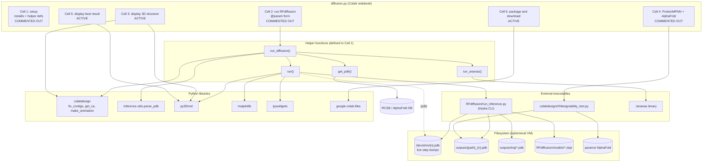
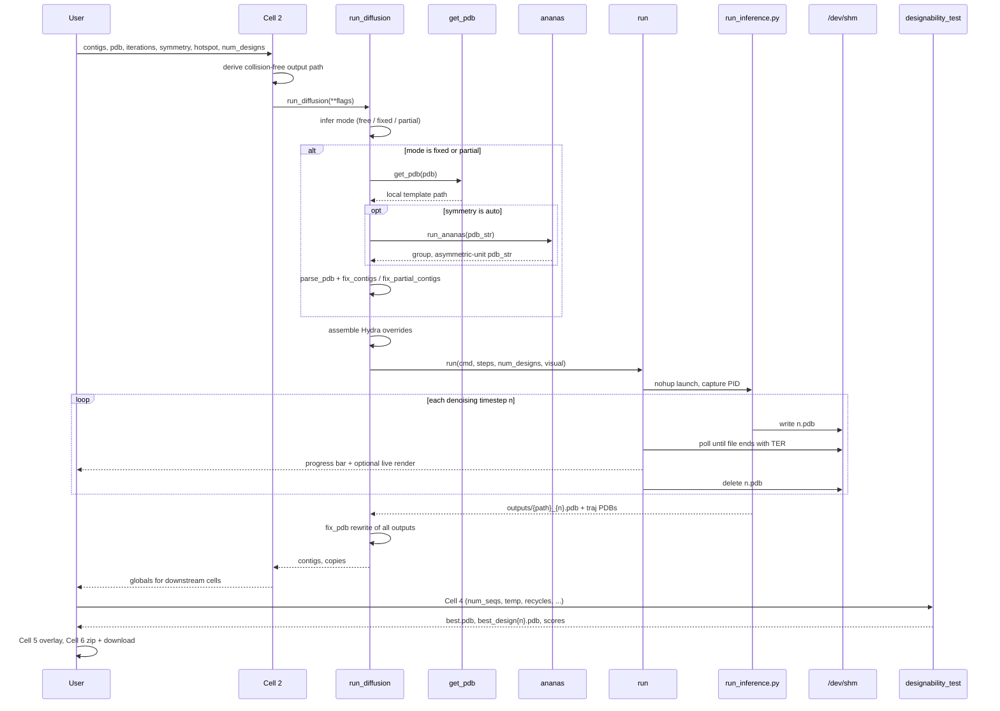

# System Architecture

## System Overview

`diffusion.py` is a **Google Colab notebook exported to a `.py` file**. It is not an application: it is a linear sequence of six notebook cells whose state is shared through the Python global namespace and the ephemeral VM filesystem. Four of the six cells are commented out (they were `%%time`-magic cells, which Colab's exporter comments out wholesale); only the three display/packaging cells survive as live Python.

Architecturally it is a **thin orchestration layer over external CLI programs**. Almost no scientific computation happens in this file — it builds command strings for `RFdiffusion/run_inference.py` and `colabdesign/rf/designability_test.py` and shells out. Its own logic is: contig parsing, mode inference, symmetry handling, filesystem-based progress polling, and visualization.

## Architecture Diagram

**Text alternative**: Cell 2 collects form parameters and calls `run_diffusion()`, which uses `get_pdb()` to fetch templates from RCSB or AlphaFold DB, `run_ananas()` to shell out to the AnAnaS symmetry binary, and colabdesign helpers to normalise contigs. It then builds a Hydra command line and hands it to `run()`, which launches `RFdiffusion/run_inference.py` as a background process and polls `/dev/shm/{n}.pdb` for per-timestep structure dumps to drive an ipywidgets progress bar and live rendering. Final PDBs land in `outputs/`, trajectories in `outputs/traj/`. Cells 3 and 5 visualize with py3Dmol; Cell 4 shells out to the designability test (ProteinMPNN + AlphaFold); Cell 6 zips and downloads via `google.colab.files`.

## Component Descriptions

### Cell 1 — Setup / Provisioning
- **Purpose**: Bootstrap the entire software environment inside a fresh Colab VM.
- **Responsibilities**: `apt-get install aria2`; background-download RFdiffusion checkpoints, schedules, and AlphaFold params; `git clone` RFdiffusion; pip-install `jedi omegaconf hydra-core icecream pyrsistent pynvml decorator`, dllogger, `dgl` (no-deps, torch-2.4/cu124 wheel index), `e3nn==0.5.5`, `opt_einsum_fx`, the vendored SE3Transformer, and ColabDesign from git; download and `chmod +x` the `ananas` binary; set `DGLBACKEND=pytorch`; append `RFdiffusion` to `sys.path`; symlink `colabdesign` from `dist-packages`.
- **Dependencies**: root/apt access, unrestricted internet, a writable CWD, a Colab-shaped `/usr/local/lib/python3.*/dist-packages`.
- **Type**: Infrastructure / provisioning (embedded in application code).

### Cell 2 — Design Invocation
- **Purpose**: Present the user-facing parameter form and trigger a run.
- **Responsibilities**: Declare 13 `#@param` variables; derive a collision-free output `path` by appending a random 5-character suffix; strip quotes from string inputs; call `run_diffusion(**flags)`; publish `contigs` and `copies` into globals for downstream cells.
- **Dependencies**: Colab's `#@param` form widgets; helper functions from Cell 1.
- **Type**: Application (UI + controller).

### `run_diffusion()` — Design Orchestrator
- **Purpose**: Turn design intent into a validated RFdiffusion Hydra invocation.
- **Responsibilities**:
  1. Create `outputs/{path}`; seed `opts` with `inference.output_prefix` and `inference.num_designs`.
  2. Resolve symmetry: `cyclic` → `(cN, N)`, `dihedral` → `(dN, 2N)`, `auto` → deferred to AnAnaS.
  3. **Infer mode** by tokenising contigs on `,`/`:`/whitespace then `/`: a segment starting with a letter marks *fixed*; a purely numeric segment marks *free*. No free segment ⇒ `partial`; free + fixed ⇒ `fixed`; free only ⇒ `free`.
  4. For `partial`/`fixed`: fetch and stringify the template, optionally run AnAnaS, filter to fixed chains, write `input.pdb`, `parse_pdb()` it, and call `fix_partial_contigs()` or `fix_contigs()`.
  5. Compute iterations: `partial` + `partial_T="auto"` ⇒ `int(80 * iterations/200)`; else `int(partial_T)`; emits `diffuser.partial_T` or `diffuser.T`.
  6. Append `ppi.hotspot_res`, symmetry config (`--config-name symmetry`, optional oligomer-contact guiding potentials), replicate contigs `copies` times, `contigmap.contigs`, `inference.dump_pdb=True`, `inference.dump_pdb_path='/dev/shm'`, and the beta checkpoint override.
  7. Call `run()`, then rewrite every output and trajectory PDB through `fix_pdb()`.
- **Dependencies**: `get_pdb`, `run_ananas`, `run`, `parse_pdb`, `pdb_to_string`, `fix_contigs`, `fix_partial_contigs`, `fix_pdb`.
- **Type**: Application (domain logic) — **the highest-value logic in the file**.

### `run()` — Process Runner / Progress Monitor
- **Purpose**: Execute inference out-of-process while streaming progress to the notebook.
- **Responsibilities**: `nohup {command} & echo $! > /dev/shm/pid` to capture the PID; liveness check via `os.kill(pid, 0)`; delete stale `/dev/shm/{n}.pdb`; for each of `num_designs × steps`, poll at 10 Hz until the step file exists and ends with `TER` (write-completeness check); advance a `FloatProgress`; optionally render; delete the consumed step file; mark the bar `danger` on process death; SIGTERM on `KeyboardInterrupt`.
- **Dependencies**: `os`, `time`, `signal`, `ipywidgets`, `matplotlib`, `py3Dmol`, `/dev/shm`.
- **Type**: Application (infrastructure adapter).

### `get_pdb()` — Template Resolver
- **Purpose**: Normalise any template identifier to a local file path.
- **Responsibilities**: empty ⇒ `google.colab.files.upload()`; existing path ⇒ pass through; 4 characters ⇒ `wget` + `gunzip` from RCSB (`.pdb1` biological assembly); otherwise ⇒ treat as UniProt and `wget` from AlphaFold DB (`model_v3`).
- **Type**: Application (integration adapter).

### `run_ananas()` — Symmetry Detector
- **Purpose**: Detect the rotational symmetry group of a template and extract its asymmetric unit.
- **Responsibilities**: Write `ananas_input.pdb`; `./ananas {in} -u -j {out}` (with optional group hint); parse JSON for group, chain names, `Average_RMSD`, centre and axes; for `c*` apply `sym_it(x, C, A[0])`, for `d*` apply `sym_it(x, C, A[1], A[0])`; rebuild fixed-width ATOM records; bare `except:` returns `(None, pdb_str)` on any failure.
- **Type**: Application (integration adapter).

### Cell 3 / Cell 5 — Visualization
- **Purpose**: Inspect backbones, trajectories, and validation overlays.
- **Responsibilities**: Cell 3 — `plot_pdb(num)` renders final structure or trajectory via py3Dmol (`addModelsAsFrames` + `animate` for interactive) or a matplotlib GIF via `make_animation`; colour by `rainbow`/`chain`/`plddt`; `ipywidgets.Dropdown` when `num_designs > 1`. Cell 5 — overlays `outputs/{path}_{num}.pdb` (plain cartoon) with `outputs/{path}/best_design{num}.pdb` (pLDDT-coloured), reading the design index from the `REMARK 001` line of `best.pdb`.
- **Type**: Application (presentation). **Note**: Cell 5 redefines `plot_pdb`, shadowing Cell 3's.

### Cell 4 — Sequence Design and Validation
- **Purpose**: Score backbone designability.
- **Responsibilities**: Block until `params/done.txt` exists; join contigs with `:`; build flags (`--pdb`, `--loc`, `--contig`, `--copies`, `--num_seqs`, `--num_recycles`, `--rm_aa`, `--mpnn_sampling_temp`, `--num_designs`, plus `--initial_guess`, `--use_multimer`, `--use_soluble`); `!python colabdesign/rf/designability_test.py {opts}`.
- **Type**: Application (controller).

### Cell 6 — Packaging and Export
- **Purpose**: Get results off the ephemeral VM.
- **Responsibilities**: `!zip -r {path}.result.zip outputs/{path}* outputs/traj/{path}*`; `files.download(...)`.
- **Type**: Application (export adapter).

## Data Flow

## Integration Points

- **External APIs / downloads**:
  - `files.rcsb.org/download/{code}.pdb1.gz` — template biological assemblies.
  - `alphafold.ebi.ac.uk/files/AF-{id}-F1-model_v3.pdb` — predicted template structures.
  - `files.ipd.uw.edu` — RFdiffusion checkpoints (`Base_ckpt.pt`, `Complex_base_ckpt.pt`, `Complex_beta_ckpt.pt`), `schedules.zip`, `ananas` binary.
  - `storage.googleapis.com/alphafold/alphafold_params_2022-12-06.tar` — AlphaFold weights (~4 GB).
  - `github.com/sokrypton/RFdiffusion`, `github.com/sokrypton/ColabDesign`, `github.com/NVIDIA/dllogger` — source installs.
  - `data.dgl.ai/wheels/torch-2.4/cu124/repo.html` — DGL wheel index.
  - `3dmol.org/build/3Dmol.js` — JS loaded at render time by every py3Dmol view.

- **Databases**: None. All state is files on disk plus Python globals.

- **Third-party services**: Google Colab runtime (`google.colab.files` for upload/download), Google Drive not used.

- **Subprocess integrations**: `RFdiffusion/run_inference.py` (Hydra CLI), `colabdesign/rf/designability_test.py`, `./ananas`, `zip`, `wget`, `gunzip`, `aria2c`, `apt-get`, `pip`, `git`.

## Infrastructure Components

- **CDK Stacks**: None.
- **Deployment Model**: None. The "deployment" is a user opening a Colab notebook; the environment is rebuilt from scratch on every session (~3 min for code, longer for the 4 GB of weights downloaded in the background).
- **Networking**: Implicitly assumes unrestricted outbound internet from the compute environment and a browser rendering `ipywidgets`/py3Dmol over Colab's own websocket transport.
- **Compute assumptions**: Single NVIDIA GPU, root access via `apt-get`, writable `/dev/shm`, and a Debian-family userland.
