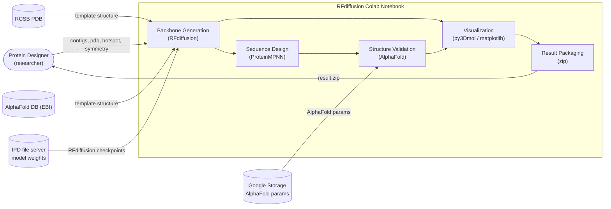

# Business Overview

## Business Context Diagram

**Text alternative**: A protein designer supplies design specifications (contigs, optional template PDB, hotspot residues, symmetry) to the notebook. The notebook pulls template structures from RCSB PDB or the AlphaFold Database, and model weights from the IPD file server and Google Storage. RFdiffusion generates protein backbones; ProteinMPNN designs sequences onto those backbones; AlphaFold predicts and validates the designed sequences. Results are visualized interactively and packaged as a zip archive returned to the designer.

## Business Description

- **Business Description**: The system is a *de novo* protein design pipeline. It lets a structural biologist or protein engineer generate novel protein backbones under geometric constraints, design amino-acid sequences that fold into those backbones, and computationally validate the designs — all without writing code, by editing form-like parameters in a Google Colab notebook.

- **Business Transactions**:

  | ID | Transaction | Description |
  |---|---|---|
  | BT-1 | **Provision Environment** | Install RFdiffusion, ColabDesign, SE3Transformer, DGL and AnAnaS; download RFdiffusion checkpoints and AlphaFold parameters. One-time per session. |
  | BT-2 | **Generate Backbone** | Run RFdiffusion inference under a chosen design protocol (unconditional, binder, motif scaffolding, or partial diffusion), with optional symmetry constraints, producing one or more backbone PDB files plus denoising trajectories. |
  | BT-3 | **Monitor Diffusion Progress** | Stream per-timestep intermediate structures from the running inference process and render them live (progress bar + image or interactive 3D). |
  | BT-4 | **Review Backbone** | Display the final backbone or animate the denoising trajectory, coloured by chain, rainbow, or pLDDT. |
  | BT-5 | **Design and Validate Sequence** | Run ProteinMPNN to sample sequences for the backbone, then AlphaFold to predict each sequence's structure and score agreement (RMSD / pLDDT) with the intended backbone. |
  | BT-6 | **Review Best Design** | Overlay the designed backbone with the AlphaFold prediction of the best-scoring sequence. |
  | BT-7 | **Export Results** | Archive all outputs and trajectories into a zip and deliver to the user. |

- **Business Dictionary**:

  | Term | Meaning |
  |---|---|
  | **contig** | A specification string describing chain composition. `/` separates segments within a chain; `:` or `,` separates chains. Numeric segments (e.g. `100`) are *free* (diffused de novo); alphanumeric segments (e.g. `A163-181`) are *fixed* (copied from a template PDB). Ranges (`70-100`) sample a random length. |
  | **free / unconditional design** | All residues generated de novo with no template. |
  | **fixed / conditional design** | Some residues are copied from a template PDB — covers *binder design* and *motif scaffolding*. |
  | **partial diffusion** | An existing structure is partially noised and re-denoised, producing variants of a known fold. |
  | **hotspot** | Target residues on a binding partner that the designed binder should contact (e.g. `E64,E88`). |
  | **symmetry** | Constraint that the output be a cyclic (`cN`) or dihedral (`dN`) homo-oligomer. `auto` detects symmetry in the template with AnAnaS. |
  | **order** | The N in cyclic/dihedral symmetry; determines the number of chain copies (`N` cyclic, `2N` dihedral). |
  | **T / iterations** | Number of diffusion denoising timesteps. |
  | **partial_T** | Number of *noising* steps used in the partial diffusion protocol. |
  | **trajectory** | Multi-model PDB recording the structure at each denoising timestep. `pX0` = model's predicted final structure at each step; `Xt-1` = the actual noised state at each step. |
  | **pLDDT** | AlphaFold per-residue confidence score, stored in the PDB B-factor column. |
  | **designability** | Whether an independently predicted structure of a designed sequence recovers the intended backbone (low RMSD, high pLDDT). |
  | **beta model** | Alternative RFdiffusion checkpoint (`Complex_beta_ckpt.pt`) giving a better balance of secondary-structure elements (less all-helix bias). |
  | **AnAnaS** | External binary that detects rotational symmetry in a structure. |

## Component Level Business Descriptions

### Setup / Provisioning Cell
- **Purpose**: Make the scientific software and model weights available in an ephemeral Colab VM.
- **Responsibilities**: apt/pip installs, parallel background download of ~4 GB of weights via `aria2c`, `sys.path` wiring, symlinking `colabdesign` into the working directory.

### `run_diffusion()` — Design Orchestrator
- **Purpose**: Translate user-facing design intent into an RFdiffusion Hydra command line.
- **Responsibilities**: Infer the design mode from the contig string; fetch/normalise the template PDB; detect or apply symmetry; compute iteration counts; assemble Hydra config overrides; invoke the runner; post-process output PDBs so chain/residue numbering matches the requested contigs.

### `run()` — Process Runner and Progress Monitor
- **Purpose**: Execute inference as a background OS process and surface live progress.
- **Responsibilities**: Launch via `nohup`, capture PID, poll `/dev/shm/{n}.pdb` for per-step dumps, update an `ipywidgets` progress bar, optionally render each intermediate structure, handle failure and `KeyboardInterrupt` (SIGTERM).

### `get_pdb()` — Template Resolver
- **Purpose**: Obtain a template structure from whatever identifier the user supplies.
- **Responsibilities**: Colab file upload when blank; pass-through for local paths; RCSB download for 4-character codes; AlphaFold DB download otherwise.

### `run_ananas()` — Symmetry Detector
- **Purpose**: Discover the symmetry group of a template and reduce it to its asymmetric unit.
- **Responsibilities**: Write input PDB, shell out to `./ananas`, parse JSON, apply the detected transform to filter coordinates to the asymmetric unit.

### Visualization Cells
- **Purpose**: Let the designer inspect results without leaving the notebook.
- **Responsibilities**: py3Dmol 3D views, matplotlib pseudo-3D renders, trajectory animations, `ipywidgets.Dropdown` for multi-design selection.

### Sequence Design / Validation Cell
- **Purpose**: Assess whether generated backbones are designable.
- **Responsibilities**: Build CLI flags and shell out to `colabdesign/rf/designability_test.py`.

### Packaging Cell
- **Purpose**: Deliver artifacts off the ephemeral VM before it is reclaimed.
- **Responsibilities**: `zip -r` of outputs and trajectories; `google.colab.files.download`.
