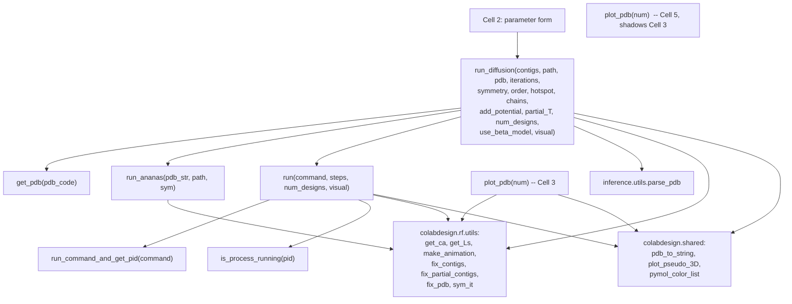

# Code Structure

## Build System

- **Type**: **None**. There is no `pyproject.toml`, `requirements.txt`, `setup.py`, `environment.yml`, `Pipfile`, or lockfile anywhere in the workspace.
- **Configuration**: Dependency management is *imperative and embedded in application code* — Cell 1 issues `os.system("pip install ...")` calls at runtime. There is no version pinning except `e3nn==0.5.5`; everything else floats.
- **Consequence for the port**: The dependency graph must be reconstructed by reading Cell 1's shell commands (see `dependencies.md`). This is the single largest reverse-engineering risk in the codebase.

## Key Modules / Call Graph

**Text alternative**: `Cell 2` calls `run_diffusion`, which calls `get_pdb`, `run_ananas`, `run`, and library helpers from `colabdesign` and `inference.utils`. `run` contains two nested closures, `run_command_and_get_pid` and `is_process_running`. `plot_pdb` is defined twice — once in Cell 3 and again in Cell 5, where the second definition shadows the first.

### Existing Files Inventory

- `diffusion.py` — the entire codebase. A Colab-exported notebook containing six cells:

  | Lines | Cell | State | Purpose |
  |---|---|---|---|
  | 1–19 | Module docstring | live | Notebook provenance and links |
  | 21–354 | Cell 1: setup | **commented out** | Environment provisioning + all helper function definitions |
  | 356–407 | Cell 2: run RFdiffusion | **commented out** | `#@param` form; calls `run_diffusion` |
  | 409–476 | Cell 3: display 3D structure | live | `plot_pdb` (final/trajectory), design dropdown |
  | 478–517 | Cell 4: ProteinMPNN + AlphaFold | **commented out** | Builds and runs `designability_test.py` |
  | 519–556 | Cell 5: display best result | live | Overlay of design vs. AlphaFold prediction |
  | 558–566 | Cell 6: package and download | live | `zip` + `files.download` |
  | 568–596 | Instructions docstring | live | User-facing contig syntax documentation |

- `CLAUDE.md` — AI-DLC workflow instructions (not application code).
- `.aidlc-rule-details/` — AI-DLC rule detail files (not application code).

**Critical observation**: Because Cells 1, 2 and 4 are commented out, **the file is not executable as Python**. Running `python diffusion.py` would fail at line 414 (`from colabdesign.shared.plot import pymol_color_list`) and, even with that installed, at line 460 with `NameError: name 'num_designs' is not defined`. The commented regions are the file's most important content and must be un-commented and read as the real source.

## Design Patterns

### Filesystem-as-IPC (progress streaming)
- **Location**: `run()` (lines 144–225), paired with `inference.dump_pdb_path='/dev/shm'` (line 330).
- **Purpose**: Observe the progress of an opaque third-party inference script without modifying it or parsing its stdout.
- **Implementation**: RFdiffusion is told to dump each denoising timestep as `/dev/shm/{n}.pdb`. The notebook polls at 10 Hz for the file's existence and checks that its contents end in `TER` to confirm the write completed, then consumes and deletes it. Liveness is tracked separately via `os.kill(pid, 0)`.
- **Assessment**: Effective and dependency-free, but tightly coupled to tmpfs semantics, a single concurrent run per machine, and a fixed step count known in advance.

### Command-string builder (Hydra override assembly)
- **Location**: `run_diffusion()`, the `opts` list (lines 234–339).
- **Purpose**: Configure RFdiffusion, whose only interface is a Hydra CLI.
- **Implementation**: A `list[str]` of `key=value` overrides accumulated conditionally and `" ".join(...)`-ed into a shell command. Quoting is done by hand, including nested quotes for the guiding-potentials list.
- **Assessment**: This is a **shell-injection surface**. Cell 2 mitigates it only by stripping `'` and `"` from string params (lines 403–405) — an inadequate defence that also silently corrupts legitimate input.

### Global-namespace state passing
- **Location**: Between all cells — `path`, `contigs`, `copies`, `num_designs`, `animate`, `color`, `denoise`, `dpi`.
- **Purpose**: Share results across cells in a notebook.
- **Assessment**: The dominant obstacle to porting. There are no function boundaries carrying this state; a web application must materialise it as an explicit job/run record.

### Strategy-by-string (`visual`, `color`, `animate`, `symmetry`)
- **Location**: throughout.
- **Implementation**: string comparison chains (`if visual == "image": ... if visual == "interactive": ...`).
- **Assessment**: Fine for a notebook; wants enums/validated literals in a typed application.

### Mode inference from input syntax
- **Location**: `run_diffusion()` lines 250–268.
- **Purpose**: Avoid asking the user which protocol they want — derive it from the contig string.
- **Implementation**: Character-class inspection of each `/`-separated segment's first token.
- **Assessment**: Elegant and worth preserving verbatim, but undocumented in code and easy to break. It deserves unit tests in the port — this is the highest-value pure function in the file.

## Anti-patterns Present

- **Provisioning inside application code** (`os.system("apt-get install ...")`, `pip install` at import time).
- **`plot_pdb` defined twice** with different signatures and semantics (lines 419 and 521).
- **Bare `except:`** in `run_ananas` (line 141) swallows every error including `KeyboardInterrupt`.
- **Parameter shadowing**: inside `run_diffusion`, the loop variable `pdb` (line 350) overwrites the `pdb` function parameter.
- **Unvalidated numeric coercion**: `int(partial_T)` on a raw string (line 304).
- **Hard-coded absolute paths**: `/dev/shm`, `./ananas`, `./RFdiffusion/models/...`, `/usr/local/lib/python3.*/dist-packages`.
- **Fixed-width PDB parsing by slicing** (`line[21:22]`, `line[30:38]`) — correct for the format, but brittle and untested.

## Critical Dependencies

### RFdiffusion (sokrypton fork)
- **Version**: unpinned (`git clone https://github.com/sokrypton/RFdiffusion.git`, default branch).
- **Usage**: `RFdiffusion/run_inference.py` invoked as a subprocess; `inference.utils.parse_pdb` imported via `sys.path` injection.
- **Purpose**: The diffusion model itself.

### ColabDesign (sokrypton)
- **Version**: unpinned (`pip install git+https://github.com/sokrypton/ColabDesign.git`).
- **Usage**: `fix_contigs`, `fix_partial_contigs`, `fix_pdb`, `sym_it`, `get_ca`, `get_Ls`, `make_animation`, `pdb_to_string`, `plot_pseudo_3D`, `pymol_color_list`; plus `colabdesign/rf/designability_test.py` as a script.
- **Purpose**: Contig normalisation, PDB post-processing, symmetry math, plotting, and the ProteinMPNN+AlphaFold designability harness.
- **Note**: The script is reached through a **symlink into `dist-packages`** (line 55) — a Colab-specific hack.

### SE3Transformer (vendored in RFdiffusion)
- **Version**: whatever is in `RFdiffusion/env/SE3Transformer`.
- **Usage**: `pip install .` from that directory.
- **Purpose**: SE(3)-equivariant attention layers used by the RFdiffusion network.

### DGL
- **Version**: unpinned, installed `--no-dependencies` from the `torch-2.4/cu124` wheel index.
- **Usage**: graph neural network backend; `DGLBACKEND=pytorch` set at line 68.
- **Purpose**: Required by SE3Transformer.
- **Note**: `--no-dependencies` is deliberate (comment at line 44: avoid pulling `nvidia-cuda-*`), which means **DGL's transitive requirements are silently assumed to be satisfied by the Colab base image**. This is the most fragile point of the whole install and the biggest risk when moving to a different environment.

### PyTorch / CUDA
- **Version**: never installed — inherited from the Colab base image (implied torch 2.4 + CUDA 12.4 by the DGL wheel index choice).
- **Purpose**: Model execution on GPU.
- **Note**: On any non-Colab target this becomes an explicit, must-be-pinned dependency.

### py3Dmol / ipywidgets / matplotlib / IPython
- **Version**: unpinned; py3Dmol not even explicitly installed (assumed present in Colab).
- **Usage**: All visualization and progress UI.
- **Purpose**: Notebook-bound presentation layer — **the part with no equivalent in a web application and therefore the part that must be rewritten rather than ported**.

### google.colab
- **Version**: N/A (Colab-only module).
- **Usage**: `files.upload()` in `get_pdb`, `files.download()` in Cell 6.
- **Purpose**: File I/O with the user's browser.
- **Note**: **Hard blocker** — this module does not exist outside Colab and must be replaced by HTTP upload/download.
