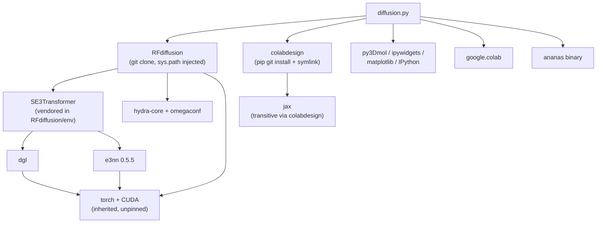

# Dependencies

## Internal Dependencies

**Text alternative**: `diffusion.py` depends directly on the RFdiffusion checkout, ColabDesign, the visualization libraries, `google.colab`, and the `ananas` binary. RFdiffusion depends on the vendored SE3Transformer and on Hydra/OmegaConf. SE3Transformer depends on DGL and e3nn, both of which depend on PyTorch/CUDA. ColabDesign brings in JAX for the AlphaFold and ProteinMPNN paths. Note that PyTorch itself is never installed by this code — it is inherited from the Colab base image.

### `diffusion.py` depends on `RFdiffusion`
- **Type**: Runtime (subprocess + `sys.path` import).
- **Reason**: `run_inference.py` is the model entry point; `inference.utils.parse_pdb` is imported directly after `sys.path.append('RFdiffusion')` (line 69).

### `diffusion.py` depends on `colabdesign`
- **Type**: Runtime (import + subprocess).
- **Reason**: Contig normalisation (`fix_contigs`, `fix_partial_contigs`), PDB repair (`fix_pdb`), symmetry math (`sym_it`), coordinate extraction (`get_ca`, `get_Ls`), plotting (`plot_pseudo_3D`, `make_animation`, `pymol_color_list`), chain filtering (`pdb_to_string`), and the `designability_test.py` harness.

### `RFdiffusion` depends on `SE3Transformer`
- **Type**: Compile/runtime — installed via `cd RFdiffusion/env/SE3Transformer; pip install .` (line 48).
- **Reason**: SE(3)-equivariant attention layers in the network.

### `SE3Transformer` depends on `dgl` and `e3nn`
- **Type**: Runtime.
- **Reason**: Graph construction and equivariant tensor operations.
- **Critical note**: Both are installed with `--no-dependencies`, so their own requirement graphs are unresolved and assumed satisfied by the ambient image.

## External Dependencies

### Python packages installed by Cell 1

| Package | Version | Install mechanism | Purpose | License |
|---|---|---|---|---|
| `jedi` | unpinned | pip | IDE/introspection helper (likely incidental) | MIT |
| `omegaconf` | unpinned | pip | Hydra's config backend | BSD-3-Clause |
| `hydra-core` | unpinned | pip | RFdiffusion's CLI/config system | MIT |
| `icecream` | unpinned | pip | Debug printing used inside RFdiffusion | MIT |
| `pyrsistent` | unpinned | pip | Immutable data structures (transitive need) | MIT |
| `pynvml` | unpinned | pip | GPU introspection | BSD-3-Clause |
| `decorator` | unpinned | pip | Utility (transitive need) | BSD-2-Clause |
| `dllogger` | unpinned | `git+https://github.com/NVIDIA/dllogger` | Logging for SE3Transformer | Apache-2.0 |
| `dgl` | unpinned | pip `--no-dependencies`, `torch-2.4/cu124` wheel index | Graph NN backend | Apache-2.0 |
| `e3nn` | **`0.5.5`** | pip `--no-dependencies` | E(3)-equivariant primitives | MIT |
| `opt_einsum_fx` | unpinned | pip `--no-dependencies` | Einsum optimisation for e3nn | MIT |
| `SE3Transformer` | vendored | `pip install .` from RFdiffusion checkout | SE(3) attention | Apache-2.0 (NVIDIA) |
| `colabdesign` | unpinned | `git+https://github.com/sokrypton/ColabDesign.git` | Design utilities + designability harness | Apache-2.0 |

### Assumed present, never installed (Colab base image)

| Package | Purpose | Risk on port |
|---|---|---|
| `torch` + CUDA runtime | Model execution | **HIGH** — must be pinned explicitly; the `cu124`/`torch-2.4` DGL wheel index is the only evidence of the expected version |
| `numpy` | Coordinate math | Low |
| `matplotlib` | Plotting | Low |
| `py3Dmol` | 3D visualization | Low — but being replaced anyway |
| `ipywidgets` | Progress UI | N/A — being replaced |
| `IPython` | `display`/`HTML` | N/A — being replaced |
| `jax` / `jaxlib` | AlphaFold + ProteinMPNN | **HIGH** — GPU-enabled JAX pinning is notoriously version-sensitive |
| `google.colab` | Upload/download | **BLOCKER** — does not exist off Colab |

### System packages

| Package | Install | Purpose | Risk on port |
|---|---|---|---|
| `aria2` | `apt-get install aria2` | 16-connection parallel download of ~8 GB of weights | **BLOCKER** — requires root, unavailable on Grex |
| `wget`, `gunzip`, `zip`, `unzip`, `git`, `nohup` | preinstalled | Fetching, extraction, archiving, process detachment | Low — generally available |

### Downloaded binaries and model assets

| Asset | Source | Size | Notes |
|---|---|---|---|
| `ananas` | `files.ipd.uw.edu/krypton/ananas` | small | Precompiled Linux binary; `chmod +x`; no license stated at that URL |
| `schedules.zip` | `files.ipd.uw.edu/krypton/schedules.zip` | small | Diffusion noise schedules |
| `Base_ckpt.pt` | `files.ipd.uw.edu/pub/RFdiffusion/6f5902ac.../` | ~1.3 GB | Default checkpoint |
| `Complex_base_ckpt.pt` | `files.ipd.uw.edu/pub/RFdiffusion/e29311f6.../` | ~1.3 GB | Complex/binder checkpoint |
| `Complex_beta_ckpt.pt` | `files.ipd.uw.edu/pub/RFdiffusion/f572d396.../` | ~1.3 GB | Better SSE balance |
| `alphafold_params_2022-12-06.tar` | `storage.googleapis.com/alphafold/` | ~4 GB | AlphaFold weights, extracted into `params/` |

### Runtime network endpoints

| Endpoint | When | Purpose |
|---|---|---|
| `files.rcsb.org/download/{code}.pdb1.gz` | template is a 4-char PDB code | Biological assembly download |
| `alphafold.ebi.ac.uk/files/AF-{id}-F1-model_v3.pdb` | template is any other string | Predicted structure download |
| `3dmol.org/build/3Dmol.js` | every py3Dmol render | JS library fetched by the browser |

## Dependency Risk Summary for the Port

Ordered by severity:

1. **`google.colab` (BLOCKER)** — must be removed entirely; upload/download rewritten as HTTP.
2. **`apt-get install aria2` (BLOCKER)** — no root on Grex; replace with `curl`/`wget` or pre-staged assets.
3. **Unpinned torch/CUDA/JAX (HIGH)** — the notebook works only because Colab's image happened to be compatible. A `uv` lockfile must pin these deliberately against Grex's CUDA modules (`cuda/12.2` is documented) or a container.
4. **`dgl` with `--no-dependencies` from a torch-2.4/cu124 wheel index (HIGH)** — the most fragile install step. DGL's GPU wheels are tightly coupled to specific torch/CUDA combinations, and `uv` will need an explicit index configuration (`[[tool.uv.index]]`) to reach them.
5. **Unpinned git installs of RFdiffusion and ColabDesign (MEDIUM)** — reproducibility depends on pinning a commit SHA.
6. **`dist-packages` symlink (MEDIUM)** — Colab-specific path assumption; must be replaced with a proper install or vendored checkout.
7. **`/dev/shm` fixed filenames (MEDIUM)** — collide between concurrent users on a shared cluster; must be namespaced per job.
8. **`ananas` precompiled binary (LOW-MEDIUM)** — should run on Grex's Linux nodes, but provenance and glibc compatibility are unverified.
