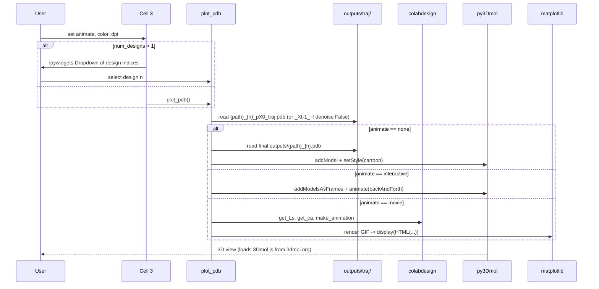
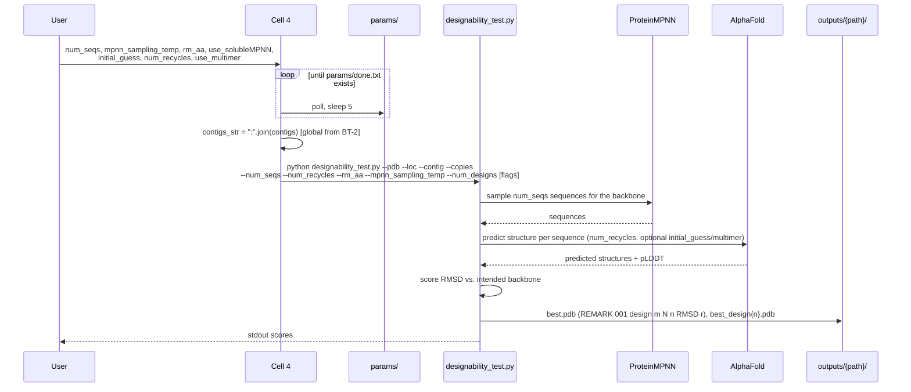
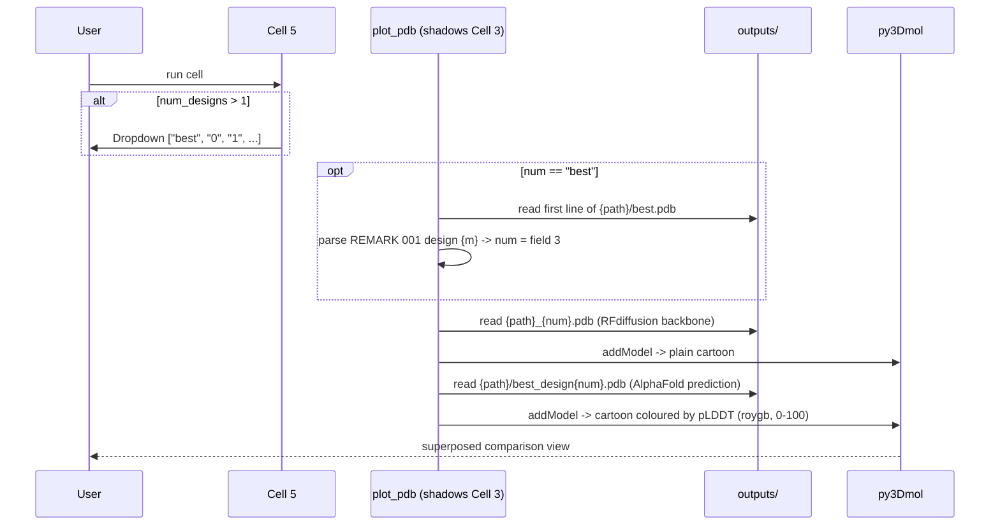
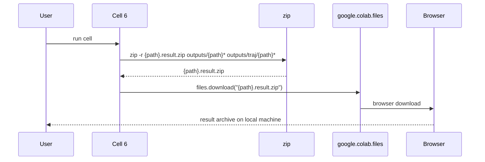
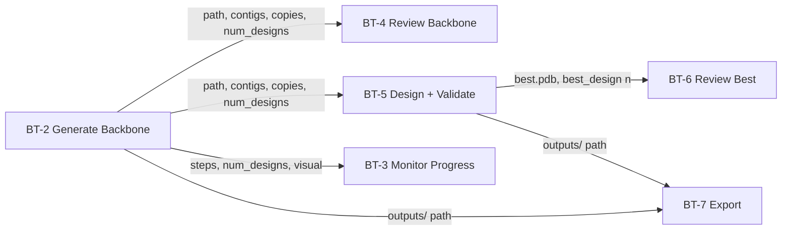

# Interaction Diagrams

How each business transaction (from `business-overview.md`) is realised across the components in `architecture.md`.

---

## BT-1: Provision Environment

```mermaid
sequenceDiagram
    participant U as User
    participant C1 as Cell 1
    participant APT as apt / pip / git
    participant IPD as files.ipd.uw.edu
    participant GCS as storage.googleapis.com
    participant FS as VM filesystem

    U->>C1: run setup cell
    C1->>APT: apt-get install aria2 (requires root)
    C1->>IPD: aria2c -x16 schedules.zip, 3 checkpoints (background &)
    C1->>GCS: aria2c -x16 alphafold_params.tar (background &)
    Note over C1,GCS: downloads detached; code install proceeds in parallel
    C1->>APT: git clone RFdiffusion
    C1->>APT: pip install hydra-core, omegaconf, dllogger, dgl, e3nn==0.5.5, SE3Transformer
    C1->>APT: pip install git+ColabDesign
    C1->>FS: ln -s /usr/local/lib/python3.*/dist-packages/colabdesign ./colabdesign
    C1->>IPD: wget ananas; chmod +x
    loop until each *.aria2 marker disappears
        C1->>FS: poll, sleep 5
    end
    C1->>FS: mv checkpoints to RFdiffusion/models/; unzip schedules
    C1->>FS: touch params/done.txt
    C1->>C1: os.environ["DGLBACKEND"]="pytorch"; sys.path.append("RFdiffusion")
    C1-->>U: imports resolved, ~3 min elapsed
```

**Port impact**: This entire transaction disappears. It is replaced by a one-time `uv sync` against a lockfile plus a one-time weight-staging step onto persistent storage. The `apt-get` step (root) and the `dist-packages` symlink have no Grex equivalent at all.

---

## BT-2: Generate Backbone

```mermaid
sequenceDiagram
    participant U as User
    participant C2 as Cell 2 form
    participant RD as run_diffusion
    participant GP as get_pdb
    participant NET as RCSB / AlphaFold DB
    participant AN as run_ananas -> ./ananas
    participant CD as colabdesign utils
    participant R as run
    participant RF as run_inference.py
    participant FS as outputs/

    U->>C2: 13 form parameters
    C2->>C2: derive collision-free path (random 5-char suffix)
    C2->>C2: strip quotes from string params
    C2->>RD: run_diffusion(**flags)
    RD->>RD: resolve symmetry -> (sym, copies)
    RD->>RD: tokenise contigs -> infer mode

    alt mode is fixed or partial
        RD->>GP: get_pdb(pdb)
        alt blank
            GP->>U: files.upload() browser dialog
        else 4-char code
            GP->>NET: wget RCSB {code}.pdb1.gz; gunzip
        else other
            GP->>NET: wget AlphaFold AF-{id}-F1-model_v3.pdb
        end
        GP-->>RD: local path
        RD->>CD: pdb_to_string(path, chains)
        opt symmetry == auto
            RD->>AN: run_ananas(pdb_str, path)
            AN->>AN: ./ananas -u -j out.json
            AN->>CD: sym_it() per ATOM to extract asymmetric unit
            AN-->>RD: (group, reduced pdb_str) or (None, unchanged)
        end
        RD->>FS: write outputs/{path}/input.pdb
        RD->>RD: parse_pdb -> fix_contigs / fix_partial_contigs
    end

    RD->>RD: assemble Hydra overrides (opts list)
    RD->>R: run(cmd, iterations, num_designs, visual)
    R->>RF: nohup launch; capture PID
    RF->>FS: outputs/{path}_{n}.pdb + outputs/traj/*.pdb
    R-->>RD: returns when process exits
    RD->>CD: fix_pdb() rewrite of every output and trajectory
    RD-->>C2: (normalised contigs, copies)
    C2-->>U: globals published for downstream cells
```

**Port impact**: `run_diffusion`'s logic ports almost verbatim and is the core asset. What changes: `get_pdb`'s upload branch, the shell-string assembly (must become an argument list), and the return values (must become a persisted run record rather than notebook globals).

---

## BT-3: Monitor Diffusion Progress

```mermaid
sequenceDiagram
    participant R as run
    participant OS as OS process table
    participant RF as run_inference.py
    participant SHM as /dev/shm
    participant W as ipywidgets
    participant U as User

    R->>SHM: delete stale {0..steps-1}.pdb
    R->>RF: nohup {cmd} & echo $! > /dev/shm/pid
    R->>R: read PID, remove pid file
    R->>W: display VBox(FloatProgress, Output)

    loop for each design, for each step n
        loop poll every 100 ms
            R->>SHM: does {n}.pdb exist?
            alt exists and content ends with TER
                R->>R: wait = False
            else process dead
                R->>OS: os.kill(pid, 0) -> OSError
                R->>W: bar_style = danger, description = failed
            end
        end
        R->>W: progress.value = (n+1)/steps
        opt visual == image
            R->>W: get_ca + plot_pseudo_3D -> matplotlib figure
        end
        opt visual == interactive
            R->>W: py3Dmol view of {n}.pdb
        end
        R->>SHM: delete {n}.pdb
        W-->>U: live progress and structure
    end

    loop until process exits
        R->>OS: os.kill(pid, 0); sleep 100 ms
    end

    opt KeyboardInterrupt
        R->>OS: os.kill(pid, SIGTERM)
        R->>W: bar_style = danger, description = stopped
    end
```

**Port impact**: **Full rewrite.** There is no ipywidgets in a web app, and on a shared cluster the fixed `/dev/shm` paths collide between users. The transaction becomes: job writes step dumps to a per-run scratch directory; the web server exposes run status; the browser polls or subscribes (SSE/websocket) and renders with 3Dmol.js client-side. The `TER`-suffix completeness check and the PID-liveness pattern are worth carrying over conceptually; under Slurm, liveness is better answered by `squeue`/`sacct` than by `os.kill`.

---

## BT-4: Review Backbone



**Port impact**: Rewrite as browser-side rendering. Note that py3Dmol already delegates to client-side 3Dmol.js — so the *rendering* is already happening in the browser, and only the Python wrapper needs replacing. The matplotlib "movie" path is server-side and would need either server-side GIF generation or a client-side frame animation instead.

---

## BT-5: Design and Validate Sequence



**Port impact**: Ports with moderate change. The blocking `params/done.txt` poll disappears (weights are pre-staged). The `!python` magic becomes a subprocess or a second Slurm step. Because this stage is itself GPU-bound and long-running, it is a natural second job rather than something to run inline in a web request.

---

## BT-6: Review Best Design



**Port impact**: Same as BT-4 — client-side rendering. Also the point at which the `plot_pdb` shadowing bug (TD-10) must be resolved by giving the two views distinct names.

---

## BT-7: Export Results



**Port impact**: `google.colab.files.download` is a hard blocker and becomes an HTTP download endpoint. On Grex there is also a viable alternative the notebook never had: results already live on persistent `/project` storage, so download is a convenience rather than a necessity for data survival — and for large result sets, Globus is the documented transfer path.

---

## Cross-Transaction State Dependencies



**The single most important finding for the port**: every downstream transaction depends on state produced by BT-2 and carried in the Python global namespace — `path`, `contigs` (normalised and symmetry-replicated), `copies`, and `num_designs`. In a notebook this is free. In a web application it must become an explicit, persisted **run record**, because HTTP requests share no memory and a Slurm job outlives the request that submitted it.
